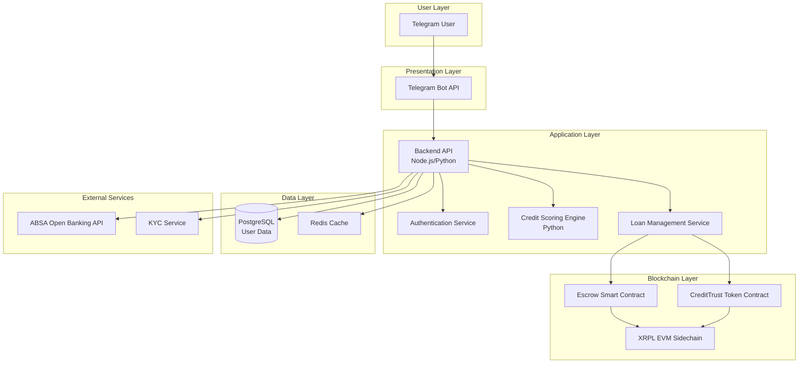
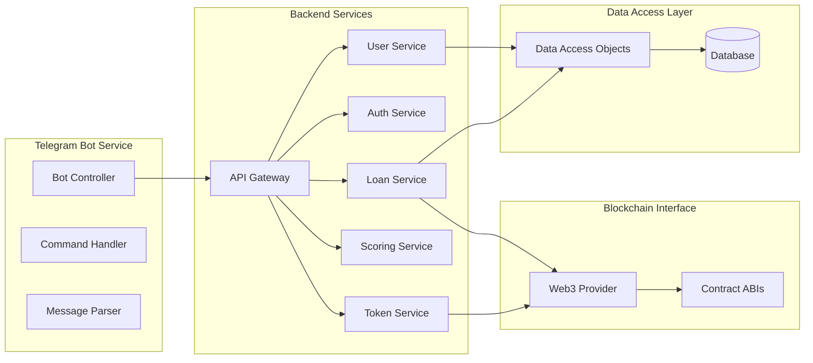
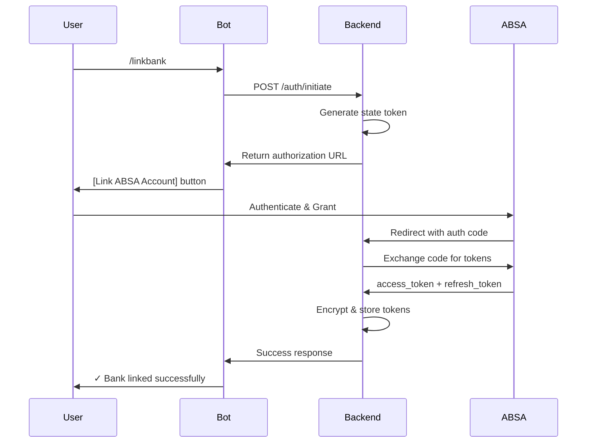
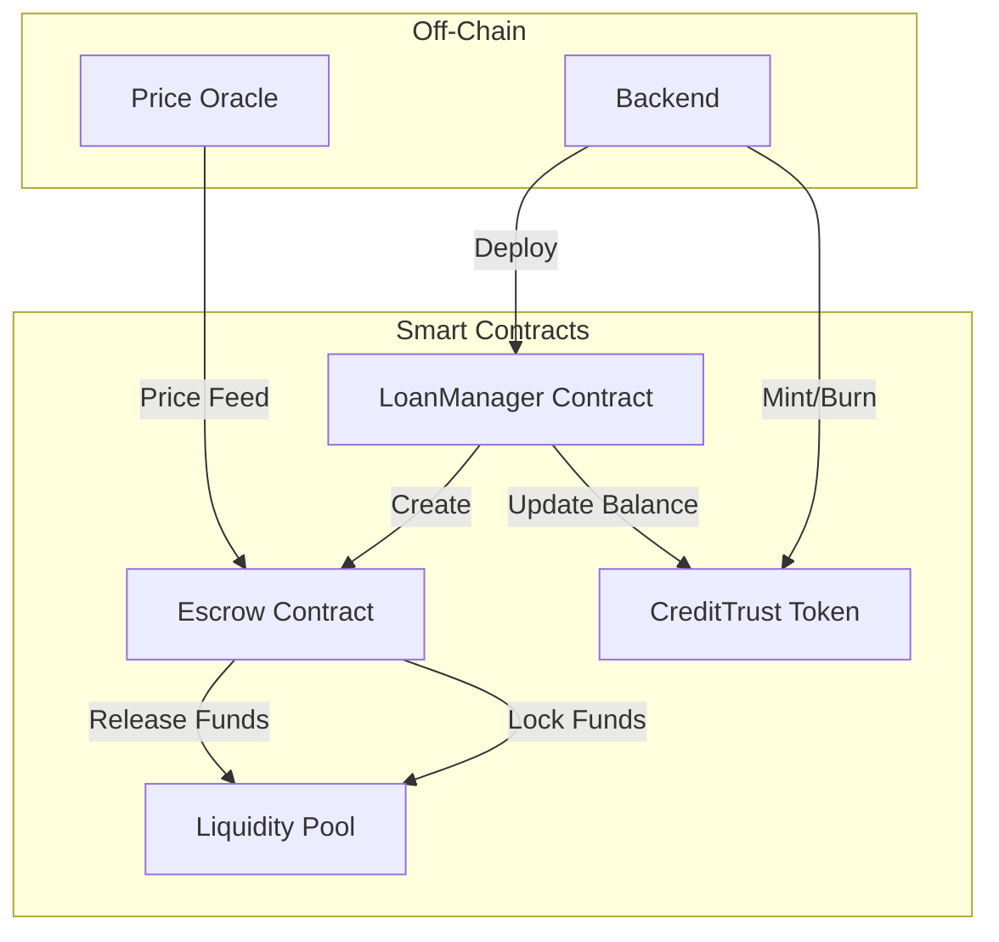
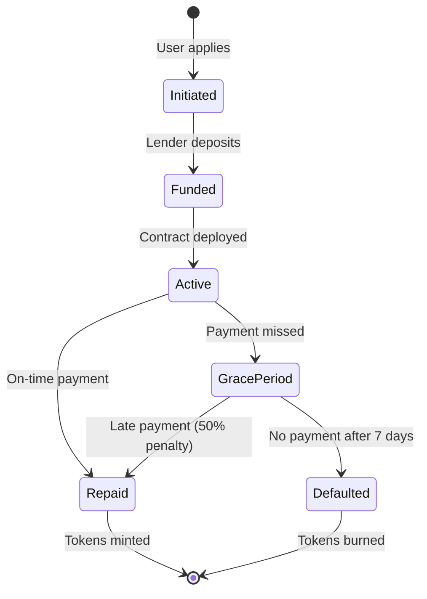

## Table of Contents

1. [Executive Summary](https://www.notion.so/Project-Technical-Specification-Document-28b0a48718ac8004a8a6f5ae048d8b96?pvs=21)
2. [Background & Context](https://www.notion.so/Project-Technical-Specification-Document-28b0a48718ac8004a8a6f5ae048d8b96?pvs=21)
3. [User Research](https://www.notion.so/Project-Technical-Specification-Document-28b0a48718ac8004a8a6f5ae048d8b96?pvs=21)
4. [Requirements Specification](https://www.notion.so/Project-Technical-Specification-Document-28b0a48718ac8004a8a6f5ae048d8b96?pvs=21)
5. [Product Specification](https://www.notion.so/Project-Technical-Specification-Document-28b0a48718ac8004a8a6f5ae048d8b96?pvs=21)
6. [Technical Specification](https://www.notion.so/Project-Technical-Specification-Document-28b0a48718ac8004a8a6f5ae048d8b96?pvs=21)
7. [Implementation Plan](https://www.notion.so/Project-Technical-Specification-Document-28b0a48718ac8004a8a6f5ae048d8b96?pvs=21)
8. [Appendices](https://www.notion.so/Project-Technical-Specification-Document-28b0a48718ac8004a8a6f5ae048d8b96?pvs=21)

---

# 1. Executive Summary

## 1.1 Project Overview

The Nkadime Lending Platform is a decentralized micro-lending solution designed to address financial exclusion in South Africa by leveraging Open Banking APIs and blockchain infrastructure. The platform enables individuals with thin or non-existent credit histories to access affordable credit through alternative credit scoring mechanisms.

## 1.2 Core Objectives

1. **Financial Inclusion:** Provide credit access to banked individuals excluded from traditional lending
2. **Alternative Credit Scoring:** Calculate creditworthiness using transaction data rather than credit bureau reports
3. **Decentralized Trust:** Build reputation through blockchain-based CreditTrust Tokens
4. **Accessible Interface:** Enable lending via Telegram bot (mobile-first, low-barrier entry)
5. **Smart Escrow:** Automate loan management through XRPL EVM smart contracts

## 1.3 Scope

**In Scope:**

- Telegram bot interface for borrowers
- ABSA Open Banking API integration (sandbox)
- Python-based alternative credit scoring engine
- XRPL EVM smart contracts for loan escrow and token minting
- CreditTrust Token system (non-transferable reputation tokens)
- KYC verification workflow
- Loan application, approval, and repayment flows

**Out of Scope:**

- Web dashboard interface
- Multiple bank integrations (ABSA only for POC)
- Live production deployment
- P2P lender matching (using liquidity pool instead)
- Cross-chain bridging features

## 1.4 Success Criteria

- Functional Telegram bot with complete loan lifecycle
- Working ABSA API integration in sandbox environment
- Deployed smart contracts on XRPL EVM testnet
- Alternative credit score calculation for thin-file users
- Token minting on successful loan repayment
- Complete technical documentation and architecture diagrams

---

# 2. Background & Context

## 2.1 Problem Statement

In South Africa, a significant percentage of banked individuals cannot access affordable credit due to thin or non-existent credit histories. This systemic gap perpetuates financial exclusion despite:

- High smartphone penetration
- Growing digital banking adoption
- Available transaction data that could indicate creditworthiness

Traditional credit scoring relies on credit bureau data that doesn't exist for thin-file individuals, creating a catch-22: no credit history means no credit access, but no credit access means no way to build history.

## 2.2 Market Context

**[PLACEHOLDER - Business Team Input Needed]**

- Market sizing: Number of banked individuals without credit access
- Current informal lending market size and rates
- Smartphone/Telegram penetration in target demographic
- Competitor analysis (existing micro-lending solutions)
- Regulatory landscape overview

## 2.3 Solution Approach

The platform addresses this through three key mechanisms:

1. **Alternative Data Source:** Uses 6 months of banking transaction data (income regularity, spending patterns, balance stability) instead of credit bureau reports
2. **Behavioral Reputation System:** CreditTrust Tokens minted on-chain provide portable, verifiable proof of repayment reliability
3. **Smart Contract Automation:** XRPL EVM smart contracts handle escrow, repayment tracking, and token distribution without intermediaries

## 2.4 Technical Foundation

- **ABSA Open Banking API:** Secure, user-permissioned access to transaction data
- **XRPL EVM Sidechain:** Programmable smart contracts with low transaction costs
- **Telegram Bot API:** Accessible interface requiring no app installation
- **Python Scoring Engine:** Flexible, interpretable credit scoring algorithm

---

# 3. User Research

## 3.1 User Personas

### Persona 1: Thabo Mokoena

**Demographics:**

- Age: 32
- Location: Johannesburg (Soweto)
- Occupation: Ride-hailing driver (Uber/Bolt)
- Income: R8,000–R12,000/month

**Context:**

- FNB account for 2 years
- No credit history
- High tech comfort, smartphone user

**Pain Points:**

- Unable to qualify for bank overdraft or credit card
- Dependent on mashonisas charging 30–50% monthly interest
- No way to prove repayment reliability

**Needs:**

- Affordable credit for vehicle repairs and fuel
- Platform that recognizes consistent income
- Trustworthy, digital borrowing option

---

### Persona 2: Lerato Mthembu

**Demographics:**

- Age: 27
- Location: Durban (Umlazi)
- Occupation: Freelance graphic designer
- Income: R6,000–R10,000/month

**Context:**

- Capitec account for 3 years
- Thin credit file
- High tech comfort

**Pain Points:**

- Banks reject personal loans due to "unstable" income
- Frequent cash flow gaps between projects
- Limited awareness of digital lending tools

**Needs:**

- Quick, low-interest short-term loans
- Credit score reflecting actual earning patterns
- Accessible Telegram interface

---

### Persona 3: Sibongile Dlamini

**Demographics:**

- Age: 41
- Location: Pietermaritzburg (Edendale)
- Occupation: Spaza shop owner
- Income: R12,000–R18,000/month

**Context:**

- ABSA business account for 5 years
- Thin file/informal lending history
- Medium tech comfort

**Pain Points:**

- Loan applications rejected due to lack of payslips
- High informal loan interest rates
- Difficulty separating personal and business cash flow

**Needs:**

- Small working-capital loans with flexible repayment
- CreditTrust Tokens to build reputation
- Simple Telegram interface

---

### Persona 4: Ayanda Nkosi

**Demographics:**

- Age: 22
- Location: Pretoria
- Occupation: Final-year university student
- Income: R3,000–R5,000 from part-time tutoring

**Context:**

- Standard Bank account for 1 year
- No credit history
- High tech comfort

**Pain Points:**

- Cannot access student credit cards
- Borrowing informally from peers
- No history to demonstrate responsibility

**Needs:**

- Entry-level microloans for study expenses
- System to start building credit history early
- Easy mobile chat interface

---

### Persona 5: Nomusa Khumalo

**Demographics:**

- Age: 38
- Location: Johannesburg (Alexandra)
- Occupation: Domestic worker
- Income: R4,500/month

**Context:**

- Capitec account for 4 years
- No credit history
- Medium tech comfort

**Pain Points:**

- Cannot access loans without payslips
- Relies on stokvels and mashonisas
- High data costs limit digital adoption

**Needs:**

- Telegram-based microloan access (low data usage)
- Low-fee borrowing options
- Ability to build credit without formal income proof

---

### Persona 6: Lucky Mthethwa

**Demographics:**

- Age: 36
- Location: KwaMashu, KwaZulu-Natal
- Occupation: Construction site foreman (contract-based)
- Income: R9,000–R14,000/month

**Context:**

- Nedbank client for 3 years
- Thin credit history
- Medium tech comfort

**Pain Points:**

- Inconsistent monthly income
- Struggles to access loans between contracts
- No credit record despite steady employment

**Needs:**

- Credit product that accounts for seasonal income
- Transparent loan terms
- Pathway to formal credit access

---

### Persona 7: Jabulani Mthembu

**Demographics:**

- Age: 34
- Location: East London
- Occupation: Electrical technician (contract-based)
- Income: R18,000–R22,000/month

**Context:**

- ABSA client for 6 years
- Thin file
- High tech comfort

**Pain Points:**

- Short-term cash flow gaps between projects
- High rejection rate for formal credit
- Slow traditional approval processes

**Needs:**

- Fast, data-based loan approvals
- Build credit without full-time employment
- Integration with bank data for automated scoring

---

## 3.2 User Journey Summary

**Primary User Journey (Borrower):**

1. Register via Telegram → KYC verification
2. Link ABSA account → Grant data permissions
3. System calculates credit score → Displays eligibility
4. Apply for loan → Automated approval/rejection
5. Loan disbursed → Smart contract deployed
6. Repayment via Telegram → Token minting on success
7. Improved score/limit for next loan cycle

**Key Touchpoints:**

- Telegram bot (all interactions)
- ABSA OAuth flow (bank linking)
- Blockchain transaction confirmations

---

# 4. Requirements Specification

## 4.1 Functional Requirements

### FR-1: User Management & Authentication

**FR-1.1** Users must be able to register via Telegram using phone number

**FR-1.2** System must perform KYC verification before granting platform access

**FR-1.3** Platform must support bank account linking via ABSA Open Banking API

**FR-1.4** System must request and store explicit user consent for data access

**FR-1.5** Implement role-based access control (Borrower, Admin)

### FR-2: Open Banking Integration

**FR-2.1** System must authenticate users via OAuth 2.0 with ABSA API

**FR-2.2** Platform must retrieve 6 months of transaction history

**FR-2.3** System must fetch account balances and account information

**FR-2.4** Platform must handle API rate limiting gracefully

**FR-2.5** System must support token refresh for ongoing data access

**FR-2.6** Platform must allow users to revoke data access permissions

### FR-3: Credit Scoring System

**FR-3.1** Platform must calculate alternative credit score (0-100) using transaction data

**FR-3.2** Scoring algorithm must analyze: income regularity, spending behavior, balance trends

**FR-3.3** System must categorize users into risk tiers (New, Good, Excellent, High Risk)

**FR-3.4** Score must map to token tiers with corresponding loan caps and APRs

**FR-3.5** Credit score must update after each loan cycle

**FR-3.6** System must provide score explanation to users

### FR-4: Loan Application & Management

**FR-4.1** Borrowers must be able to submit loan applications via Telegram

**FR-4.2** System must validate loan amount against credit limit and token tier

**FR-4.3** Platform must provide automated approval/rejection with reasoning

**FR-4.4** System must deploy smart contract escrow upon approval

**FR-4.5** Platform must disburse funds to borrower's linked account

**FR-4.6** Borrowers must be able to check loan status via Telegram commands

**FR-4.7** System must track repayment schedules and due dates

**FR-4.8** Platform must support partial and full repayments

### FR-5: Smart Contract Operations

**FR-5.1** System must deploy loan escrow contracts on XRPL EVM sidechain

**FR-5.2** Smart contracts must handle state transitions (Pending → Active → Completed/Defaulted)

**FR-5.3** Contracts must automatically release funds to lender upon repayment

**FR-5.4** Platform must trigger grace period workflows for late payments

**FR-5.5** System must handle default scenarios and token penalties

### FR-6: CreditTrust Token System

**FR-6.1** Platform must mint non-transferable tokens after successful loan repayment

**FR-6.2** Token amount must equal loan_amount / 100

**FR-6.3** System must burn tokens for late/defaulted repayments

**FR-6.4** Platform must maintain token balance mapping to user addresses

**FR-6.5** Token tiers must determine max loan caps and base APRs

**FR-6.6** Users must be able to view token balance via Telegram

### FR-7: Telegram Bot Interface

**FR-7.1** Bot must support commands: /start, /register, /linkbank, /apply, /status, /repay, /score, /tokens, /help

**FR-7.2** System must provide guided conversation flows for each command

**FR-7.3** Bot must display clear error messages and recovery options

**FR-7.4** Platform must send proactive notifications for loan events

**FR-7.5** Bot must support inline keyboards for user selections

**FR-7.6** System must maintain conversation context across sessions

### FR-8: Compliance & Audit

**FR-8.1** Platform must log all data access events

**FR-8.2** System must maintain audit trail of loan lifecycle events

**FR-8.3** Platform must support user data export requests

**FR-8.4** System must allow users to delete their data (right to erasure)

**FR-8.5** Platform must comply with POPIA data protection principles

---

## 4.2 Non-Functional Requirements

### NFR-1: Performance

**NFR-1.1** API calls must complete within 2 seconds (95th percentile)

**NFR-1.2** System must support 100 concurrent users in POC phase

**NFR-1.3** Smart contract deployment must complete within 30 seconds

**NFR-1.4** Telegram bot must respond to commands within 1 second

### NFR-2: Security

**NFR-2.1** All data transmission must use TLS 1.3 encryption

**NFR-2.2** Sensitive data must be encrypted at rest using AES-256

**NFR-2.3** API keys and secrets must be stored in secure key management system

**NFR-2.4** System must implement rate limiting to prevent abuse

**NFR-2.5** Platform must validate all user inputs to prevent injection attacks

### NFR-3: Reliability

**NFR-3.1** System must have 99.5% uptime (testnet environment)

**NFR-3.2** Failed transactions must retry with exponential backoff

**NFR-3.3** Platform must gracefully handle API timeouts

**NFR-3.4** System must log all errors with stack traces for debugging

### NFR-4: Scalability

**NFR-4.1** Architecture must support horizontal scaling of backend services

**NFR-4.2** Database must handle 10,000+ user records

**NFR-4.3** Smart contracts must optimize gas costs

### NFR-5: Usability

**NFR-5.1** Telegram interface must use plain language (no jargon)

**NFR-5.2** Error messages must provide actionable recovery steps

**NFR-5.3** Bot flows must require minimal user input

**NFR-5.4** System must provide progress indicators for long-running operations

### NFR-6: Maintainability

**NFR-6.1** Code must follow consistent style guidelines

**NFR-6.2** All functions must have unit tests (80% coverage target)

**NFR-6.3** API endpoints must be documented with OpenAPI/Swagger

**NFR-6.4** Smart contracts must include inline comments explaining logic

---

## 4.3 Requirements Traceability Matrix

| Req ID | Requirement | User Story | System Component |
| --- | --- | --- | --- |
| FR-1.1 | Register via Telegram | US-001 | Telegram Bot, Auth Service |
| FR-1.2 | KYC verification | US-002 | KYC Module |
| FR-1.3 | Bank linking | US-003 | ABSA API Integration |
| FR-3.1 | Calculate credit score | US-007 | Scoring Engine |
| FR-4.1 | Submit loan application | US-010 | Telegram Bot, Loan Service |
| FR-4.4 | Deploy escrow contract | US-011, US-012 | Smart Contract Module |
| FR-6.1 | Mint tokens on repayment | US-016 | Token Contract |

*(Full matrix available in Appendix A)*

---

# 5. Product Specification

## 5.1 User Interface Design

### 5.1.1 Platform Scope

**Primary Interface:** Telegram Bot (mobile-first)

**Excluded:** Web dashboard (out of scope for POC)

All user interactions occur through Telegram commands and conversation flows. The bot provides:

- Guided onboarding and KYC
- Loan application wizards
- Status checking and notifications
- Repayment processing
- Help and support

### 5.1.2 UI Component Library

The following components define the Telegram bot user experience:

### Conversational Components

**Chat Bubbles:**

```
| Type | Description | Example |
|------|-------------|---------|
| Bot Message | Primary delivery for instructions | "Welcome to Nkadime!" |
| Inline Status | System progress updates | "Analyzing transaction data..." |
| Success Bubble | Green border, checkmark | "Loan contract deployed ✓" |
| Error Bubble | Red border, warning icon | "⚠️ Invalid ID format" |

```

**Quick Reply Buttons:**

```
| Type | Description | Example |
|------|-------------|---------|
| Primary Action | Main CTA, solid color | "Apply for Loan" |
| Secondary | Optional paths, outlined | "Learn More" |
| Destructive | Cancel/decline, red accent | "Decline" |
| Toggle Group | FAQ/help selections | "How to apply" / "Requirements" |
```

### Information Cards

```
| Component | Use Case | Content |
|-----------|----------|---------|
| Loan Summary | Display active loan | "Loan #002 — R1,500 — Active" |
| Credit Score Card | Show score and timeline | "Score: 67 (Fair) — Next Review: 30 days" |
| Token Balance | Display reputation | "CTT Balance: 3.2 — Good Reputation" |
| Repayment Confirmation | Payment dialog | "Confirm payment: R500?" |
```

### Status Components

```
| Component | State | Visual |
|-----------|-------|--------|
| Status Badge | Active | 🟢 Active |
| | Repaid | 🟣 Repaid |
| | Pending | 🟠 Pending |
| | Declined | 🔴 Declined |
| Progress Bar | Application stage | "KYC → Bank → Offer → Accept" |
| Notification Banner | Event alerts | "Funds successfully disbursed." |
```

### Input Components

```
| Input Type | Description | Validation |
|------------|-------------|------------|
| Text Input (ID) | 13-digit RSA ID | Regex: ^\d{13}$ |
| Image Upload | Selfie verification | AI/ML match via API |
| OAuth Redirect | Bank linking | Secure callback |
| Amount Input | Repayment amounts | Min: R50; Max: outstanding |
```

---

## 5.2 Conversation Flows

### 5.2.1 Welcome & Registration Flow

```markdown
User: /start

Bot: Welcome to Nkadime! 🌟
     We help you access affordable credit using your banking data.
     
     What would you like to do?
     [Apply for Loan] [Check Eligibility] [Learn More] [Help]

User: [Apply for Loan]

Bot: Great! Let's start your loan application.
     First, we need to verify your identity.
     
     Please enter your South African ID number:

User: 9206155808083

Bot: ✓ ID format verified
     
     Now, please upload a selfie holding your ID card clearly.

User: [uploads image]

Bot: ✓ Image verification successful
     
     Next, let's link your bank account securely.
     [Link ABSA Account]

[Redirects to OAuth → Returns]

Bot: ✓ Bank linked successfully
     
     Analyzing your transaction data... ⏳

Bot: Credit Score: 67 (Fair)
     You are eligible for a loan offer!
     
     📋 Loan Offer: R1,500 at 25% APR
     Repayable over 3 months (R542/month)
     
     [Accept Terms] [View Details] [Decline]
```

### 5.2.2 Repayment Flow

```markdown
User: /repay

Bot: Please enter the amount you'd like to pay:
     Example: /repay 500

User: /repay 500

Bot: You're about to repay R500
     Remaining balance after payment: R1,000
     
     Confirm payment?
     [Yes, Confirm] [Cancel]

User: [Yes, Confirm]

Bot: ⏳ Processing transaction...
     
     ✓ Payment received!
     Remaining balance: R1,000
     Next payment due: 15 Oct 2025
     
     🏆 Keep it up! Timely repayments improve your CreditTrust score.
```

### 5.2.3 Status Check Flow

```markdown
User: /status

Bot: 📊 Current Loan Status
     
     Loan #002
     Amount: R1,500
     Repaid: R500
     Remaining: R1,000
     Next Payment: 15 Oct 2025
     Status: 🟢 Active
     
     [Make Payment] [View History]
```

### 5.2.4 Credit Score Flow

```markdown
User: /score

Bot: 📈 Credit Score Summary
     
     Score: 67/100 (Fair)
     Token Balance: 3.2 CTT (Good Reputation)
     
     Score Factors:
     ✓ Timely repayments: Strong
     ⚠️ Account balance: Improving  
     ✓ Income regularity: Good
     
     Next Review: 30 days
     
     [How to Improve] [Token Info]
```

### 5.2.5 Help Flow

```markdown
User: /help

Bot: 🤝 How can I assist you?
     
     [Loan Application]
     [Repayment]
     [Credit Score]
     [General Help]

User: [Loan Application]

Bot: Here's what I can help with:
     
     • How to apply
     • Why my application failed
     • Document requirements
     
     Select a topic:

User: [How to apply]

Bot: 📝 To apply for a loan:
     
     1. Type /apply
     2. Provide your ID and selfie
     3. Link your ABSA account
     4. Wait for credit assessment
     5. Accept loan offer if eligible
     
     Once accepted, funds will be disbursed within 24 hours.
```

*(Full conversation specifications in Appendix B)*

---

# 6. Technical Specification

## 6.1 System Architecture

### 6.1.1 High-Level Architecture



### 6.1.2 Component Architecture



---

## 6.2 API Specification

### 6.2.1 Authentication & Permissions

### OAuth 2.0 Authorization Flow



### Permission Management

**Data Access Scopes:**

```
**Data Access Scopes:**
| Permission Level | Access | Duration |
|-----------------|--------|----------|
| Basic Consent | Account info, balances | 30 days |
| Transaction Consent | + 3 months transactions | 90 days |
| Full Consent | + 6 months transactions | 90 days (renewable) |
```

**Consent Storage:**

python

```python
{
    'user_id': 'uuid',
    'consent_id': 'uuid',
    'permissions': ['account.info', 'transactions.read'],
    'granted_at': '2025-10-14T10:00:00Z',
    'expires_at': '2026-01-12T10:00:00Z',
    'status': 'active'
}
```

---

### 6.2.2 Key API Endpoints

### User Management

```python
POST /api/v1/user/register
Content-Type: application/json

{
  "phone_number": "+27123456789",
  "id_number": "9206155808083",
  "telegram_user_id": "123456789"
}

Response 201:
{
  "user_id": "uuid",
  "status": "pending_kyc",
  "message": "Registration successful. Please complete KYC."
}
```

```python
POST /api/v1/kyc/verify
Content-Type: multipart/form-data

{
  "user_id": "uuid",
  "id_document": <file>,
  "selfie": <file>
}

Response 200:
{
  "status": "verified",
  "confidence_score": 0.95,
  "message": "KYC verification successful"
}
```

### Bank Linking

```python
POST /api/v1/bank/link
Content-Type: application/json

{
  "user_id": "uuid",
  "authorization_code": "auth_code_from_absa"
}

Response 200:
{
  "status": "linked",
  "account_id": "encrypted_account_id",
  "bank": "ABSA",
  "message": "Bank account linked successfully"
}
```

```python
GET /api/v1/bank/transactions?user_id={uuid}&months=6
Authorization: Bearer {token}

Response 200:
{
  "transactions": [
    {
      "date": "2025-10-01",
      "description": "Salary Deposit",
      "amount": 8500.00,
      "type": "credit",
      "category": "income"
    },
    ...
  ],
  "count": 180,
  "period": "6 months"
}
```

### Credit Scoring

```python
POST /api/v1/score/calculate
Content-Type: application/json

{
  "user_id": "uuid"
}

Response 200:
{
  "trust_score": 67,
  "risk_category": "fair",
  "factors": {
    "income_regularity": 75,
    "balance_stability": 60,
    "spending_behavior": 65,
    "transaction_volume": 70
  },
  "explanation": "Score based on 6 months of transaction data",
  "calculated_at": "2025-10-14T10:30:00Z"
}
```

```python
GET /api/v1/score/profile?user_id={uuid}
Authorization: Bearer {token}

Response 200:
{
  "trust_score": 67,
  "token_balance": 3.2,
  "token_tier": "Good",
  "max_loan_cap": 5000,
  "base_apr": 20,
  "last_updated": "2025-10-14T10:30:00Z"
}
```

### Loan Management

```python
POST /api/v1/loan/apply
Content-Type: application/json

{
  "user_id": "uuid",
  "amount": 1500,
  "term_months": 3,
  "purpose": "Vehicle repair"
}

Response 200:
{
  "loan_id": "uuid",
  "status": "pending_approval",
  "offer": {
    "amount": 1500,
    "term_months": 3,
    "apr": 25,
    "monthly_payment": 542,
    "total_repayable": 1626
  }
}
```

```python
POST /api/v1/loan/approve
Content-Type: application/json

{
  "loan_id": "uuid",
  "user_acceptance": true
}

Response 200:
{
  "loan_id": "uuid",
  "status": "active",
  "contract_address": "0x...",
  "disbursement_status": "pending",
  "message": "Loan approved. Deploying smart contract..."
}
```

```python
POST /api/v1/loan/repay
Content-Type: application/json

{
  "loan_id": "uuid",
  "amount": 500
}

Response 200:
{
  "transaction_id": "uuid",
  "loan_id": "uuid",
  "amount_paid": 500,
  "remaining_balance": 1000,
  "next_due_date": "2025-11-15",
  "tokens_minted": 5,
  "status": "success"
}
```

### Token Operations

```python
GET /api/v1/token/balance?user_id={uuid}
Authorization: Bearer {token}

Response 200:
{
  "user_id": "uuid",
  "token_balance": 3.2,
  "tier": "Good",
  "tier_benefits": {
    "max_loan_cap": 5000,
    "base_apr": 20
  },
  "wallet_address": "0x..."
}
```

*(Complete API documentation in Appendix C)*

---

## 6.3 Credit Scoring Algorithm

### 6.3.1 Scoring Methodology

The alternative credit scoring engine analyzes 6 months of transaction data across five pillars:

**Pillar 1: Income Regularity (Weight: 30%)**

- Measures consistency of income deposits
- Identifies salary vs. irregular income patterns
- Flags: regular monthly deposits, consistent amounts

**Pillar 2: Balance Stability (Weight: 25%)**

- Average balance over period
- Minimum balance (avoid negative)
- Balance volatility (standard deviation)

**Pillar 3: Spending Behavior (Weight: 20%)**

- Essential vs. discretionary spending ratio
- Bill payment consistency
- Cash withdrawal patterns

**Pillar 4: Transaction Volume (Weight: 15%)**

- Number of transactions per month
- Account activity level
- Banking engagement

**Pillar 5: Financial Health Indicators (Weight: 10%)**

- Savings behavior (deposits > withdrawals)
- Overdraft/NSF incidents
- Emergency expense handling

### 6.3.2 Score Calculation

```python
def calculate_trust_score(transactions):
    """
    Calculate alternative credit score (0-100)
    """
    *# Extract features*
    features = extract_features(transactions)
    
    *# Calculate pillar scores*
    income_score = calculate_income_regularity(features)
    balance_score = calculate_balance_stability(features)
    spending_score = calculate_spending_behavior(features)
    volume_score = calculate_transaction_volume(features)
    health_score = calculate_financial_health(features)
    
    *# Weighted combination*
    trust_score = (
        income_score * 0.30 +
        balance_score * 0.25 +
        spending_score * 0.20 +
        volume_score * 0.15 +
        health_score * 0.10
    )
    
    return round(trust_score, 2)
```

### 6.3.3 Risk Categorization

```
Trust ScoreCategoryDescription80-100ExcellentVery low risk, consistent income, stable balances60-79GoodLow risk, regular income, occasional volatility40-59FairMedium risk, irregular income, moderate stability0-39PoorHigh risk, inconsistent patterns, financial stress
```

### 6.3.4 Token Tier Mapping

```
Token BalanceTierTrust Score EquivMax LoanBase APR101+Excellent80+R7,50015%21-100Good60-79R5,00020%0-20New Borrower40-59R2,00025%< 0High Risk< 40R1,50035%
```

*(Detailed scoring algorithm in Appendix D)*

---

## 6.4 Token Economics

### 6.4.1 Core Concepts

The CreditTrust Token (CTT) is a **non-transferable** (soulbound) reputation token that:

- Reflects borrower reliability through on-platform behavior
- Influences loan terms but never overrides legal compliance
- Provides portable proof of repayment history
- Cannot be bought, sold, or transferred

**Three-Tier Framework:**

```python
Tier 1: Legal Compliance (MANDATORY)
  ├─ KYC/AML verification
  ├─ Explicit data consent
  ├─ NCA affordability assessment
  └─ Interest rate caps

Tier 2: Creditworthiness (HIGH PRIORITY)
  ├─ TrustScore calculation
  └─ Banking behavior analysis

Tier 3: Reputation (DYNAMIC)
  ├─ CreditTrust Token balance
  └─ Repayment history tracking

Final Decision: MIN(Tier1_Cap, Tier2_Cap, Tier3_Cap, Requested_Amount)
```

### 6.4.2 Token Mechanics

**Initial State:**

- All users start with 0 tokens
- Token balance can go negative (indicates defaults)

**Minting (On-Time Repayment):**

```python
def mint_tokens(loan_amount):
    """Mint tokens after successful repayment"""
    SCALING_FACTOR = 100
    tokens_to_mint = loan_amount / SCALING_FACTOR
    return tokens_to_mint

*# Example: R1,500 loan → 15 tokens minted*
```

**Burning (Late/Default Repayment):**

```python
def burn_tokens(loan_amount, days_late):
    """Burn tokens for late/default repayment"""
    SCALING_FACTOR = 100
    base_penalty = loan_amount / SCALING_FACTOR
    
    if days_late <= 7:  *# Grace period*
        return base_penalty * 0.5  *# 50% penalty*
    else:
        return base_penalty * 1.0  *# Full penalty*
```

### 6.4.3 Reputation Tiers

```
Token BalanceTierMax LoanBase APRDescription101+ExcellentR7,50015%Proven track record21-100GoodR5,00020%Reliable borrower0-20NewR2,00025%Building reputation< 0High RiskR1,50035%Recovery needed
```

### 6.4.4 First Loan Policy

**Compliance-First Approval:**

```python
def get_first_loan_eligibility(user_id):
    """First-time borrowers must pass all gates"""
    
    *# GATE 1: KYC Verification*
    if not kyc_verified(user_id):
        return reject("Complete KYC verification")
    
    *# GATE 2: Data Consent*
    if not valid_consent(user_id):
        return reject("Grant data consent")
    
    *# GATE 3: TrustScore*
    trust_score = calculate_trust_score(user_id)
    if trust_score >= 80:
        trust_cap = 2000
    elif trust_score >= 60:
        trust_cap = 1500
    elif trust_score >= 40:
        trust_cap = 1000
    else:
        trust_cap = 500
    
    *# GATE 4: NCA Affordability*
    nca_cap = assess_affordability(user_id)
    
    *# GATE 5: Token Tier (0 tokens = New Borrower)*
    token_cap = 2000
    
    *# Apply minimum*
    final_cap = min(trust_cap, nca_cap, token_cap)
    
    return {
        'approved': final_cap >= 500,
        'max_loan': final_cap,
        'base_apr': 25
    }
```

### 6.4.5 Credit Rehabilitation

**Pathways for Negative Balance Recovery:**

1. **Micro-Rehabilitation Loans**
    - Token balance: -20 to 0
    - Max loan: R500
    - Requires guarantor
    - Earn 1.5x tokens on success
2. **Time-Based Recovery**
    - Good banking behavior over 3 months
    - Automatic token restoration: min(5, |balance| * 0.1) per month
3. **Educational Bonus**
    - Complete financial literacy modules
    - Earn +10 tokens (max recovery to 0)

*(Complete token economics in Appendix E)*

---

## 6.5 Smart Contract Specification

### 6.5.1 Contract Architecture



### 6.5.2 Loan State Machine



### 6.5.3 Key Smart Contracts

### CreditTrust Token Contract

```solidity
*// SPDX-License-Identifier: MIT*
pragma solidity ^0.8.0;

contract CreditTrustToken {
    mapping(address => int256) public tokenBalance;
    mapping(address => bool) public isInitialized;
    
    event UserInitialized(address indexed user, uint256 trustScore);
    event TokensMinted(address indexed user, uint256 amount);
    event TokensBurned(address indexed user, uint256 amount);
    
    function initializeUser(address user, uint256 trustScore) 
        external 
        onlyAuthorized 
    {
        require(!isInitialized[user], "Already initialized");
        tokenBalance[user] = 0;
        isInitialized[user] = true;
        emit UserInitialized(user, trustScore);
    }
    
    function mintTokens(address user, uint256 amount) 
        external 
        onlyAuthorized 
    {
        require(isInitialized[user], "User not initialized");
        tokenBalance[user] += int256(amount);
        emit TokensMinted(user, amount);
    }
    
    function burnTokens(address user, uint256 amount) 
        external 
        onlyAuthorized 
    {
        require(isInitialized[user], "User not initialized");
        tokenBalance[user] -= int256(amount);
        emit TokensBurned(user, amount);
    }
    
    function getBalance(address user) external view returns (int256) {
        return tokenBalance[user];
    }
}
```

### Loan Escrow Contract

```solidity
contract LoanEscrow {
    enum LoanState { Initiated, Funded, Active, GracePeriod, Repaid, Defaulted }
    
    struct Loan {
        address borrower;
        uint256 amount;
        uint256 term;
        uint256 apr;
        uint256 dueDate;
        LoanState state;
    }
    
    mapping(uint256 => Loan) public loans;
    uint256 public loanCounter;
    
    CreditTrustToken public creditToken;
    uint256 constant SCALING_FACTOR = 100;
    uint256 constant GRACE_PERIOD = 7 days;
    
    event LoanCreated(uint256 indexed loanId, address borrower, uint256 amount);
    event RepaymentReceived(uint256 indexed loanId, uint256 amount);
    event LoanDefaulted(uint256 indexed loanId);
    
    function createLoan(
        address borrower,
        uint256 amount,
        uint256 term,
        uint256 apr
    ) external onlyAuthorized returns (uint256) {
        loanCounter++;
        loans[loanCounter] = Loan({
            borrower: borrower,
            amount: amount,
            term: term,
            apr: apr,
            dueDate: block.timestamp + (term * 30 days),
            state: LoanState.Initiated
        });
        emit LoanCreated(loanCounter, borrower, amount);
        return loanCounter;
    }
    
    function processRepayment(uint256 loanId) external payable {
        Loan storage loan = loans[loanId];
        require(msg.sender == loan.borrower, "Not borrower");
        require(loan.state == LoanState.Active, "Invalid state");
        
        uint256 tokenChange = loan.amount / SCALING_FACTOR;
        
        if (block.timestamp <= loan.dueDate) {
            *// On-time: mint full tokens*
            creditToken.mintTokens(loan.borrower, tokenChange);
            loan.state = LoanState.Repaid;
        } else if (block.timestamp <= loan.dueDate + GRACE_PERIOD) {
            *// Grace period: mint 50% tokens*
            creditToken.mintTokens(loan.borrower, tokenChange / 2);
            loan.state = LoanState.Repaid;
        } else {
            revert("Grace period expired");
        }
        
        emit RepaymentReceived(loanId, msg.value);
    }
    
    function triggerDefault(uint256 loanId) external {
        Loan storage loan = loans[loanId];
        require(block.timestamp > loan.dueDate + GRACE_PERIOD, "Still in grace");
        
        uint256 tokenPenalty = loan.amount / SCALING_FACTOR;
        creditToken.burnTokens(loan.borrower, tokenPenalty);
        loan.state = LoanState.Defaulted;
        
        emit LoanDefaulted(loanId);
    }
}
```

*(Complete smart contract code in Appendix F)*

---

## 6.6 Technology Stack Suggestions

### 6.6.1 Backend Services

**Runtime Environment:**

- Node.js 18.x (API Gateway, Bot Service)
- Python 3.11 (Credit Scoring Engine)

**Frameworks:**

- Express.js (REST API)
- python-telegram-bot (Telegram integration)
- FastAPI (Scoring service)

**Blockchain:**

- Web3.js / ethers.js (XRPL EVM interaction)
- Solidity 0.8.x (Smart contracts)

### 6.6.2 Data Layer

**Primary Database:**

- PostgreSQL 15.x (User data, loan records)

**Caching:**

- Redis 7.x (use Upstash)

**Blob Storage:**

- S3 bucket would work but incur costs (KYC documents)

### 6.6.3 External Integrations

**Open Banking:**

- ABSA Open Banking API (Sandbox)
- OAuth 2.0 authentication

**Messaging:**

- Telegram Bot API

**Blockchain:**

- XRPL EVM Testnet

### 6.6.4 DevOps & Infrastructure

**Containerization:**

- Docker & Docker Compose

**Version Control:**

- Git / GitHub

**CI/CD:**

- GitHub Actions (optional)

**Monitoring:**

- Winston (Logging)
- Sentry (Error tracking)

---

# 7. Implementation Plan

## 7.1 Development Phases

**Phase 1: Foundation (Week 1-2)**

- User registration & KYC
- ABSA API integration (OAuth)
- Basic Telegram bot commands
- Database schema setup

**Phase 2: Core Features (Week 2-3)**

- Credit scoring engine
- Loan application flow
- Smart contract deployment
- Token minting logic

**Phase 3: Integration (Week 3-4)**

- End-to-end loan lifecycle
- Repayment processing
- Error handling & recovery
- Testing & debugging

**Phase 4: Polish (Week 4)**

- UI/UX refinements
- Documentation completion
- Demo preparation
- Final testing

## 7.2 Key Milestones

```
| Date | Milestone | Deliverable |
|------|-----------|-------------|
| Oct 17 | Specification Complete | This document + Architecture |
| Oct 24 | POC Check-in | Working bot + API integration |
| Oct 31 | POC Complete | Full loan lifecycle demo |
| Nov 3 | Final Submission | Presentation + Demo |
```

## 7.3 Critical Dependencies

**External Dependencies:**

- ABSA API sandbox access
- XRPL EVM testnet availability
- Telegram Bot API token (obtained)

**Internal Dependencies:**

- Backend services → Smart contracts
- Credit score → Loan approval
- KYC verification → Bank linking

## 8. Appendices

---

## Appendix A: Complete Requirements Traceability Matrix

*(Detailed mapping of all requirements to user stories and components)*

## Appendix B: Complete Conversation Flows

*(Full Telegram bot conversation specifications)*

## Appendix C: Complete API Documentation

*(OpenAPI/Swagger specifications for all endpoints)*

## Appendix D: Detailed Scoring Algorithm

*(Python implementation with feature extraction logic)*

## Appendix E: Complete Token Economics

*(Token calculation formulas and rehabilitation pathways)*

## Appendix F: Smart Contract Code

*(Complete Solidity code for all contracts)*

## Appendix G: Test Plans

*(Unit, integration, and end-to-end test specifications)*

---

**Document Status:** Draft v1.0

**Next Review:** October 15, 2025

**Approvals Required:**

- [ ]  Maqhobosheane (CEO) - Strategic alignment
- [ ]  Joseph (COO) - Resource allocation
- [ ]  Marc (CTO) - Technical feasibility
- [ ]  Victor (Business Lead) - Market validation
- [ ]  Ces (BA Lead) - Requirements completeness