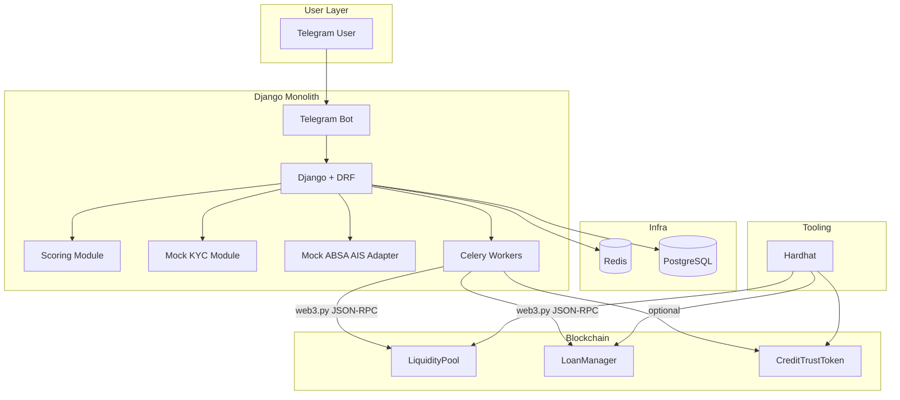
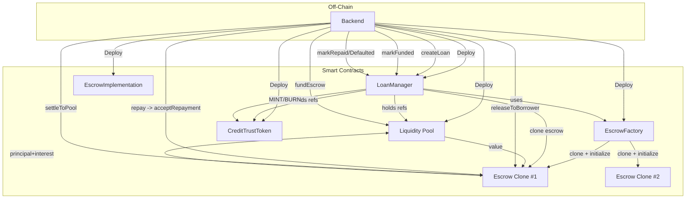
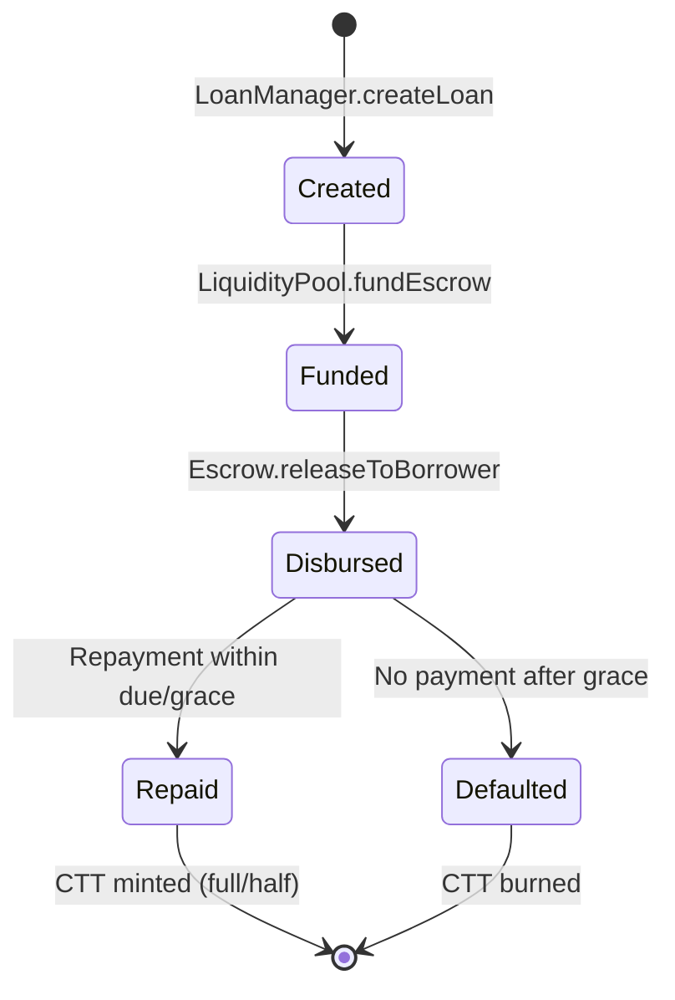

## Table of Contents

1. [Executive Summary](https://www.notion.so/Project-Technical-Specification-Document-28b0a48718ac8004a8a6f5ae048d8b96?pvs=21)
2. [Background & Context](https://www.notion.so/Project-Technical-Specification-Document-28b0a48718ac8004a8a6f5ae048d8b96?pvs=21)
3. [User Research](https://www.notion.so/Project-Technical-Specification-Document-28b0a48718ac8004a8a6f5ae048d8b96?pvs=21)
4. [Requirements Specification](https://www.notion.so/Project-Technical-Specification-Document-28b0a48718ac8004a8a6f5ae048d8b96?pvs=21)
5. [Product Specification](https://www.notion.so/Project-Technical-Specification-Document-28b0a48718ac8004a8a6f5ae048d8b96?pvs=21)
6. [Technical Specification](https://www.notion.so/Project-Technical-Specification-Document-28b0a48718ac8004a8a6f5ae048d8b96?pvs=21)
7. [Implementation Plan](https://www.notion.so/Project-Technical-Specification-Document-28b0a48718ac8004a8a6f5ae048d8b96?pvs=21)
8. [Appendices](https://www.notion.so/Project-Technical-Specification-Document-28b0a48718ac8004a8a6f5ae048d8b96?pvs=21)

---

# 1. Executive Summary

## 1.1 Project Overview

The Nkadime Lending Platform is a decentralized micro-lending solution designed to address financial exclusion in South Africa by leveraging Open Banking APIs and blockchain infrastructure. The platform enables individuals with thin or non-existent credit histories to access affordable credit through alternative credit scoring mechanisms.

## 1.2 Core Objectives

1. **Financial Inclusion:** Provide credit access to banked individuals excluded from traditional lending
2. **Alternative Credit Scoring:** Calculate creditworthiness using transaction data rather than credit bureau reports
3. **Decentralized Trust:** Build reputation through blockchain-based CreditTrust Tokens
4. **Accessible Interface:** Enable lending via Telegram bot (mobile-first, low-barrier entry)
5. **Smart Escrow:** Automate loan management through XRPL EVM smart contracts

## 1.3 Scope

**In Scope:**

- Telegram bot interface for borrowers via Django
- ABSA Open Banking API integration (sandbox)
- Python-based alternative credit scoring engine
- XRPL EVM smart contracts for loan escrow and token minting
- CreditTrust Token system (non-transferable reputation tokens)
- KYC verification workflow (mocked)
- Loan application, approval, and repayment flows

**Out of Scope:**

- Web dashboard interface
- Multiple bank integrations (ABSA only for POC)
- Live production deployment
- P2P lender matching (using liquidity pool instead)
- Cross-chain bridging features

## 1.4 Success Criteria

- Functional Telegram bot with complete loan lifecycle
- Working ABSA API integration in sandbox environment
- Deployed smart contracts on XRPL EVM testnet
- Alternative credit score calculation for thin-file users
- Token minting on successful loan repayment
- Complete technical documentation and architecture diagrams

---

# 2. Background & Context

## 2.1 Problem Statement

In South Africa, a significant percentage of banked individuals cannot access affordable credit due to thin or non-existent credit histories. This systemic gap perpetuates financial exclusion despite:

- High smartphone penetration
- Growing digital banking adoption
- Available transaction data that could indicate creditworthiness

Traditional credit scoring relies on credit bureau data that doesn't exist for thin-file individuals, creating a catch-22: no credit history means no credit access, but no credit access means no way to build history.

## 2.2 Market Context

**[PLACEHOLDER - Business Team Input Needed]**

- Market sizing: Number of banked individuals without credit access
- Current informal lending market size and rates
- Smartphone/Telegram penetration in target demographic
- Competitor analysis (existing micro-lending solutions)
- Regulatory landscape overview

## 2.3 Solution Approach

The platform addresses this through three key mechanisms:

1. **Alternative Data Source:** Uses 6 months of banking transaction data (income regularity, spending patterns, balance stability) instead of credit bureau reports
2. **Behavioral Reputation System:** CreditTrust Tokens minted on-chain provide portable, verifiable proof of repayment reliability
3. **Smart Contract Automation:** XRPL EVM smart contracts handle escrow, repayment tracking, and token distribution without intermediaries

## 2.4 Technical Foundation

- **ABSA Open Banking API:** Secure, user-permissioned access to transaction data
- **XRPL EVM Sidechain:** Programmable smart contracts with low transaction costs
- **Telegram Bot API:** Accessible interface requiring no app installation
- **Python Scoring Engine:** Flexible, interpretable credit scoring algorithm

---

# 3. User Research

## 3.1 User Personas

### Persona 1: Thabo Mokoena

**Demographics:**

- Age: 32
- Location: Johannesburg (Soweto)
- Occupation: Ride-hailing driver (Uber/Bolt)
- Income: R8,000–R12,000/month

**Context:**

- FNB account for 2 years
- No credit history
- High tech comfort, smartphone user

**Pain Points:**

- Unable to qualify for bank overdraft or credit card
- Dependent on mashonisas charging 30–50% monthly interest
- No way to prove repayment reliability

**Needs:**

- Affordable credit for vehicle repairs and fuel
- Platform that recognizes consistent income
- Trustworthy, digital borrowing option

---

### Persona 2: Lerato Mthembu

**Demographics:**

- Age: 27
- Location: Durban (Umlazi)
- Occupation: Freelance graphic designer
- Income: R6,000–R10,000/month

**Context:**

- Capitec account for 3 years
- Thin credit file
- High tech comfort

**Pain Points:**

- Banks reject personal loans due to "unstable" income
- Frequent cash flow gaps between projects
- Limited awareness of digital lending tools

**Needs:**

- Quick, low-interest short-term loans
- Credit score reflecting actual earning patterns
- Accessible Telegram interface

---

### Persona 3: Sibongile Dlamini

**Demographics:**

- Age: 41
- Location: Pietermaritzburg (Edendale)
- Occupation: Spaza shop owner
- Income: R12,000–R18,000/month

**Context:**

- ABSA business account for 5 years
- Thin file/informal lending history
- Medium tech comfort

**Pain Points:**

- Loan applications rejected due to lack of payslips
- High informal loan interest rates
- Difficulty separating personal and business cash flow

**Needs:**

- Small working-capital loans with flexible repayment
- CreditTrust Tokens to build reputation
- Simple Telegram interface

---

### Persona 4: Ayanda Nkosi

**Demographics:**

- Age: 22
- Location: Pretoria
- Occupation: Final-year university student
- Income: R3,000–R5,000 from part-time tutoring

**Context:**

- Standard Bank account for 1 year
- No credit history
- High tech comfort

**Pain Points:**

- Cannot access student credit cards
- Borrowing informally from peers
- No history to demonstrate responsibility

**Needs:**

- Entry-level microloans for study expenses
- System to start building credit history early
- Easy mobile chat interface

---

### Persona 5: Nomusa Khumalo

**Demographics:**

- Age: 38
- Location: Johannesburg (Alexandra)
- Occupation: Domestic worker
- Income: R4,500/month

**Context:**

- Capitec account for 4 years
- No credit history
- Medium tech comfort

**Pain Points:**

- Cannot access loans without payslips
- Relies on stokvels and mashonisas
- High data costs limit digital adoption

**Needs:**

- Telegram-based microloan access (low data usage)
- Low-fee borrowing options
- Ability to build credit without formal income proof

---

### Persona 6: Lucky Mthethwa

**Demographics:**

- Age: 36
- Location: KwaMashu, KwaZulu-Natal
- Occupation: Construction site foreman (contract-based)
- Income: R9,000–R14,000/month

**Context:**

- Nedbank client for 3 years
- Thin credit history
- Medium tech comfort

**Pain Points:**

- Inconsistent monthly income
- Struggles to access loans between contracts
- No credit record despite steady employment

**Needs:**

- Credit product that accounts for seasonal income
- Transparent loan terms
- Pathway to formal credit access

---

### Persona 7: Jabulani Mthembu

**Demographics:**

- Age: 34
- Location: East London
- Occupation: Electrical technician (contract-based)
- Income: R18,000–R22,000/month

**Context:**

- ABSA client for 6 years
- Thin file
- High tech comfort

**Pain Points:**

- Short-term cash flow gaps between projects
- High rejection rate for formal credit
- Slow traditional approval processes

**Needs:**

- Fast, data-based loan approvals
- Build credit without full-time employment
- Integration with bank data for automated scoring

---

## 3.2 User Journey Summary

**Primary User Journey (Borrower):**

1. Register via Telegram → KYC verification
2. Link ABSA account → Grant data permissions
3. System calculates credit score → Displays eligibility
4. Apply for loan → Automated approval/rejection
5. Loan disbursed → Smart contract deployed
6. Repayment via Telegram → Token minting on success
7. Improved score/limit for next loan cycle

**Key Touchpoints:**

- Telegram bot (all interactions)
- ABSA OAuth flow (bank linking)
- Blockchain transaction confirmations

---

# 4. Requirements Specification

## 4.1 Functional Requirements

### FR-1: User Management & Authentication

**FR-1.1** Users must be able to register via Telegram using phone number

**FR-1.2** System must perform KYC verification before granting platform access (Mocked)

**FR-1.3** Platform must support bank account linking via ABSA Open Banking API (Sandbox)

**FR-1.4** System must request and store explicit user consent for data access

**FR-1.5** Implement role-based access control (Borrower, Admin)

### FR-2: Open Banking Integration

**FR-2.1** System must authenticate users via OAuth 2.0 with ABSA API

**FR-2.2** Platform must retrieve 6 months of transaction history

**FR-2.3** System must fetch account balances and account information

**FR-2.4** Platform must handle API rate limiting gracefully

**FR-2.5** System must support token refresh for ongoing data access

**FR-2.6** Platform must allow users to revoke data access permissions

### FR-3: Credit Scoring System

**FR-3.1** Platform must calculate alternative credit score (0-100) using transaction data

**FR-3.2** Scoring algorithm must analyze: income regularity, spending behavior, balance trends

**FR-3.3** System must categorize users into risk tiers (New, Good, Excellent, High Risk)

**FR-3.4** Score must map to token tiers with corresponding loan caps and APRs

**FR-3.5** Credit score must update after each loan cycle

**FR-3.6** System must provide score explanation to users

### FR-4: Loan Application & Management

**FR-4.1** Borrowers must be able to submit loan applications via Telegram

**FR-4.2** System must validate loan amount against credit limit and token tier

**FR-4.3** Platform must provide automated approval/rejection with reasoning

**FR-4.4** System must deploy smart contract escrow upon approval

**FR-4.5** Platform must disburse funds to borrower's linked account

**FR-4.6** Borrowers must be able to check loan status via Telegram commands

**FR-4.7** System must track repayment schedules and due dates

**FR-4.8** Platform must support partial and full repayments

### FR-5: Smart Contract Operations

**FR-5.1** System must deploy loan escrow contracts on XRPL EVM sidechain (testnet)

**FR-5.2** Smart contracts must handle state transitions (Pending → Active → Completed/Defaulted)

**FR-5.3** Contracts must return repayments to the LiquidityPool and allow the pool to account for and distribute interest pro-rata.

**FR-5.4** Platform must trigger grace period workflows for late payments

**FR-5.5** System must handle default scenarios and token penalties

### FR-6: CreditTrust Token System

**FR-6.1** Platform must mint non-transferable tokens after successful loan repayment

**FR-6.2** Token amount must equal loan_amount / 100

**FR-6.3** System must burn tokens for late/defaulted repayments

**FR-6.4** Platform must maintain token balance mapping to user addresses

**FR-6.5** Token tiers must determine max loan caps and base APRs

**FR-6.6** Users must be able to view token balance via Telegram

### FR-7: Telegram Bot Interface

**FR-7.1** Bot must support commands: /start, /register, /linkbank, /apply, /status, /repay, /score, /tokens, /help

**FR-7.2** System must provide guided conversation flows for each command

**FR-7.3** Bot must display clear error messages and recovery options

**FR-7.4** Platform must send proactive notifications for loan events

**FR-7.5** Bot must support inline keyboards for user selections

**FR-7.6** System must maintain conversation context across sessions

### FR-8: Compliance & Audit

**FR-8.1** Platform must log all data access events

**FR-8.2** System must maintain audit trail of loan lifecycle events

**FR-8.3** Platform must support user data export requests

**FR-8.4** System must allow users to delete their data (right to erasure)

**FR-8.5** Platform must comply with POPIA data protection principles

---

## 4.2 Non-Functional Requirements

### NFR-1: Performance

**NFR-1.1** API calls must complete within 2 seconds (95th percentile)

**NFR-1.2** System must support 100 concurrent users in POC phase

**NFR-1.3** Smart contract deployment must complete within 30 seconds

**NFR-1.4** Telegram bot must respond to commands within 1 second

### NFR-2: Security

**NFR-2.1** All data transmission must use TLS 1.3 encryption

**NFR-2.2** Sensitive data must be encrypted at rest using AES-256

**NFR-2.3** API keys and secrets must be stored in secure key management system

**NFR-2.4** System must implement rate limiting to prevent abuse

**NFR-2.5** Platform must validate all user inputs to prevent injection attacks

### NFR-3: Reliability

**NFR-3.1** System must have 99.5% uptime (testnet environment)

**NFR-3.2** Failed transactions must retry with exponential backoff

**NFR-3.3** Platform must gracefully handle API timeouts

**NFR-3.4** System must log all errors with stack traces for debugging

### NFR-4: Scalability

**NFR-4.1** Architecture must support horizontal scaling of backend services

**NFR-4.2** Database must handle 10,000+ user records

**NFR-4.3** Smart contracts must optimize gas costs

### NFR-5: Usability

**NFR-5.1** Telegram interface must use plain language (no jargon)

**NFR-5.2** Error messages must provide actionable recovery steps

**NFR-5.3** Bot flows must require minimal user input

**NFR-5.4** System must provide progress indicators for long-running operations

### NFR-6: Maintainability

**NFR-6.1** Code must follow consistent style guidelines

**NFR-6.2** All functions must have unit tests (80% coverage target)

**NFR-6.3** API endpoints must be documented with OpenAPI/Swagger

**NFR-6.4** Smart contracts must include inline comments explaining logic

---

## 4.3 Requirements Traceability Matrix

| Req ID | Requirement | User Story | System Component |
| --- | --- | --- | --- |
| FR-1.1 | Register via Telegram | US-001 | Telegram Bot, Auth Service |
| FR-1.2 | KYC verification | US-002 | KYC Module |
| FR-1.3 | Bank linking | US-003 | ABSA API Integration |
| FR-3.1 | Calculate credit score | US-007 | Scoring Engine |
| FR-4.1 | Submit loan application | US-010 | Telegram Bot, Loan Service |
| FR-4.4 | Deploy escrow contract | US-011, US-012 | Smart Contract Module |
| FR-6.1 | Mint tokens on repayment | US-016 | Token Contract |

*(Full matrix available in Appendix A)*

---

# 5. Product Specification

## 5.1 User Interface Design

### 5.1.1 Platform Scope

**Primary Interface:** Telegram Bot (mobile-first)

**Excluded:** Web dashboard (out of scope for POC)

All user interactions occur through Telegram commands and conversation flows. The bot provides:

- Guided onboarding and KYC
- Loan application wizards
- Status checking and notifications
- Repayment processing
- Help and support

### 5.1.2 UI Component Library

The following components define the Telegram bot user experience:

### Conversational Components

**Chat Bubbles:**

```
| Type | Description | Example |
|------|-------------|---------|
| Bot Message | Primary delivery for instructions | "Welcome to Nkadime!" |
| Inline Status | System progress updates | "Analyzing transaction data..." |
| Success Bubble | Green border, checkmark | "Loan contract deployed ✓" |
| Error Bubble | Red border, warning icon | "⚠️ Invalid ID format" |

```

**Quick Reply Buttons:**

```
| Type | Description | Example |
|------|-------------|---------|
| Primary Action | Main CTA, solid color | "Apply for Loan" |
| Secondary | Optional paths, outlined | "Learn More" |
| Destructive | Cancel/decline, red accent | "Decline" |
| Toggle Group | FAQ/help selections | "How to apply" / "Requirements" |
```

### Information Cards

```
| Component | Use Case | Content |
|-----------|----------|---------|
| Loan Summary | Display active loan | "Loan #002 — R1,500 — Active" |
| Credit Score Card | Show score and timeline | "Score: 67 (Fair) — Next Review: 30 days" |
| Token Balance | Display reputation | "CTT Balance: 3.2 — Good Reputation" |
| Repayment Confirmation | Payment dialog | "Confirm payment: R500?" |
```

### Status Components

```
| Component | State | Visual |
|-----------|-------|--------|
| Status Badge | Active | 🟢 Active |
| | Repaid | 🟣 Repaid |
| | Pending | 🟠 Pending |
| | Declined | 🔴 Declined |
| Progress Bar | Application stage | "KYC → Bank → Offer → Accept" |
| Notification Banner | Event alerts | "Funds successfully disbursed." |
```

### Input Components

```
| Input Type | Description | Validation |
|------------|-------------|------------|
| Text Input (ID) | 13-digit RSA ID | Regex: ^\d{13}$ |
| Image Upload | Selfie verification | AI/ML match via API |
| OAuth Redirect | Bank linking | Secure callback |
| Amount Input | Repayment amounts | Min: R50; Max: outstanding |
```

---

## 5.2 Conversation Flows

### 5.2.1 Welcome & Registration Flow

```markdown
User: /start

Bot: Welcome to Nkadime! 🌟
     We help you access affordable credit using your banking data.
     
     What would you like to do?
     [Apply for Loan] [Check Eligibility] [Learn More] [Help]

User: [Apply for Loan]

Bot: Great! Let's start your loan application.
     First, we need to verify your identity.
     
     Please enter your South African ID number:

User: 9206155808083

Bot: ✓ ID format verified
     
     Now, please upload a selfie holding your ID card clearly.

User: [uploads image]

Bot: ✓ Image verification successful
     
     Next, let's link your bank account securely.
     [Link ABSA Account]

[Redirects to OAuth → Returns]

Bot: ✓ Bank linked successfully
     
     Analyzing your transaction data... ⏳

Bot: Credit Score: 67 (Fair)
     You are eligible for a loan offer!
     
     📋 Loan Offer: R1,500 at 25% APR
     Repayable over 3 months (R542/month)
     
     [Accept Terms] [View Details] [Decline]
```

### 5.2.2 Repayment Flow

```markdown
User: /repay

Bot: Please enter the amount you'd like to pay:
     Example: /repay 500

User: /repay 500

Bot: You're about to repay R500
     Remaining balance after payment: R1,000
     
     Confirm payment?
     [Yes, Confirm] [Cancel]

User: [Yes, Confirm]

Bot: ⏳ Processing transaction...
     
     ✓ Payment received!
     Remaining balance: R1,000
     Next payment due: 15 Oct 2025
     
     🏆 Keep it up! Timely repayments improve your CreditTrust score.
```

### 5.2.3 Status Check Flow

```markdown
User: /status

Bot: 📊 Current Loan Status
     
     Loan #002
     Amount: R1,500
     Repaid: R500
     Remaining: R1,000
     Next Payment: 15 Oct 2025
     Status: 🟢 Active
     
     [Make Payment] [View History]
```

### 5.2.4 Credit Score Flow

```markdown
User: /score

Bot: 📈 Credit Score Summary
     
     Score: 67/100 (Fair)
     Token Balance: 3.2 CTT (Good Reputation)
     
     Score Factors:
     ✓ Timely repayments: Strong
     ⚠️ Account balance: Improving  
     ✓ Income regularity: Good
     
     Next Review: 30 days
     
     [How to Improve] [Token Info]
```

### 5.2.5 Help Flow

```markdown
User: /help

Bot: 🤝 How can I assist you?
     
     [Loan Application]
     [Repayment]
     [Credit Score]
     [General Help]

User: [Loan Application]

Bot: Here's what I can help with:
     
     • How to apply
     • Why my application failed
     • Document requirements
     
     Select a topic:

User: [How to apply]

Bot: 📝 To apply for a loan:
     
     1. Type /apply
     2. Provide your ID and selfie
     3. Link your ABSA account
     4. Wait for credit assessment
     5. Accept loan offer if eligible
     
     Once accepted, funds will be disbursed within 24 hours.
```

*(Full conversation specifications in Appendix B)*

---

# 6. Technical Specification

## 6.1 System Architecture

### 6.1.1 High-Level Architecture



### 6.1.2 Component Architecture

> Note: The “services” shown are Django apps/modules within a single monolith (not separate microservices).


---

## 6.2 API Specification

### 6.2.1 Authentication & Permissions

#### OAuth 2.0 Authorization Flow

> POC Note: ABSA OAuth + AIS are mocked no live bank tokens are used.

```mermaid
sequenceDiagram
    participant User
    participant Bot
    participant Backend
    participant ABSA
    
    User->>Bot: /linkbank
    Bot->>Backend: POST /auth/initiate
    Backend->>Backend: Generate state token
    Backend->>Bot: Return authorization URL
    Bot->>User: [Link ABSA Account] button
    User->>ABSA: Authenticate & Grant
    ABSA->>Backend: Redirect with auth code
    Backend->>ABSA: Exchange code for tokens
    ABSA->>Backend: access_token + refresh_token
    Backend->>Backend: Encrypt & store tokens
    Backend->>Bot: Success response
    Bot->>User: ✓ Bank linked successfully
```



### Permission Management

**Data Access Scopes:**

```
**Data Access Scopes:**
| Permission Level | Access | Duration |
|-----------------|--------|----------|
| Basic Consent | Account info, balances | 30 days |
| Transaction Consent | + 3 months transactions | 90 days |
| Full Consent | + 6 months transactions | 90 days (renewable) |
```

**Consent Storage:**

python

```python
{
    'user_id': 'uuid',
    'consent_id': 'uuid',
    'permissions': ['account.info', 'transactions.read'],
    'granted_at': '2025-10-14T10:00:00Z',
    'expires_at': '2026-01-12T10:00:00Z',
    'status': 'active'
}
```

---

### 6.2.2 Key API Endpoints

### User Management

```python
POST /api/v1/user/register
Content-Type: application/json

{
  "phone_number": "+27123456789",
  "id_number": "9206155808083",
  "telegram_user_id": "123456789"
}

Response 201:
{
  "user_id": "uuid",
  "status": "pending_kyc",
  "message": "Registration successful. Please complete KYC."
}
```

```python
POST /api/v1/kyc/verify
Content-Type: multipart/form-data

{
  "user_id": "uuid",
  "id_document": <file>,
  "selfie": <file>
}

Response 200:
{
  "status": "verified",
  "confidence_score": 0.95,
  "message": "KYC verification successful"
}
```

### Bank Linking

```python
POST /api/v1/bank/link
Content-Type: application/json

{
  "user_id": "uuid",
  "authorization_code": "auth_code_from_absa"
}

Response 200:
{
  "status": "linked",
  "account_id": "encrypted_account_id",
  "bank": "ABSA",
  "message": "Bank account linked successfully"
}
```

```python
GET /api/v1/bank/transactions?user_id={uuid}&months=6
Authorization: Bearer {token}

Response 200:
{
  "transactions": [
    {
      "date": "2025-10-01",
      "description": "Salary Deposit",
      "amount": 8500.00,
      "type": "credit",
      "category": "income"
    },
    ...
  ],
  "count": 180,
  "period": "6 months"
}
```

### Credit Scoring

```python
POST /api/v1/score/calculate
Content-Type: application/json

{
  "user_id": "uuid"
}

Response 200:
{
  "trust_score": 67,
  "risk_category": "fair",
  "factors": {
    "income_regularity": 75,
    "balance_stability": 60,
    "spending_behavior": 65,
    "transaction_volume": 70
  },
  "explanation": "Score based on 6 months of transaction data",
  "calculated_at": "2025-10-14T10:30:00Z"
}
```

```python
GET /api/v1/score/profile?user_id={uuid}
Authorization: Bearer {token}

Response 200:
{
  "trust_score": 67,
  "token_balance": 3.2,
  "token_tier": "Good",
  "max_loan_cap": 5000,
  "base_apr": 20,
  "last_updated": "2025-10-14T10:30:00Z"
}
```

### Loan Management

```python
POST /api/v1/loan/apply
Content-Type: application/json

{
  "user_id": "uuid",
  "amount": 1500,
  "term_months": 3,
  "purpose": "Vehicle repair"
}

Response 200:
{
  "loan_id": "uuid",
  "status": "pending_approval",
  "offer": {
    "amount": 1500,
    "term_months": 3,
    "apr": 25,
    "monthly_payment": 542,
    "total_repayable": 1626
  }
}
```

```python
POST /api/v1/loan/approve
Content-Type: application/json

{
  "loan_id": "uuid",
  "user_acceptance": true
}

Response 200:
{
  "loan_id": "uuid",
  "status": "active",
  "contract_address": "0x...",
  "disbursement_status": "pending",
  "message": "Loan approved. Deploying smart contract..."
}
```

```python
POST /api/v1/loan/repay
Content-Type: application/json

{
  "loan_id": "uuid",
  "amount": 500
}

Response 200:
{
  "transaction_id": "uuid",
  "loan_id": "uuid",
  "amount_paid": 500,
  "remaining_balance": 1000,
  "next_due_date": "2025-11-15",
  "tokens_minted": 5,
  "status": "success"
}
```

### Token Operations

```python
GET /api/v1/token/balance?user_id={uuid}
Authorization: Bearer {token}

Response 200:
{
  "user_id": "uuid",
  "token_balance": 3.2,
  "tier": "Good",
  "tier_benefits": {
    "max_loan_cap": 5000,
    "base_apr": 20
  },
  "wallet_address": "0x..."
}
```

*(Complete API documentation in Appendix C)*

---

## 6.3 Credit Scoring Algorithm

### 6.3.1 Scoring Methodology

The alternative credit scoring engine analyzes 6 months of transaction data across five pillars:

**Pillar 1: Income Regularity (Weight: 30%)**

- Measures consistency of income deposits
- Identifies salary vs. irregular income patterns
- Flags: regular monthly deposits, consistent amounts

**Pillar 2: Balance Stability (Weight: 25%)**

- Average balance over period
- Minimum balance (avoid negative)
- Balance volatility (standard deviation)

**Pillar 3: Spending Behavior (Weight: 20%)**

- Essential vs. discretionary spending ratio
- Bill payment consistency
- Cash withdrawal patterns

**Pillar 4: Transaction Volume (Weight: 15%)**

- Number of transactions per month
- Account activity level
- Banking engagement

**Pillar 5: Financial Health Indicators (Weight: 10%)**

- Savings behavior (deposits > withdrawals)
- Overdraft/NSF incidents
- Emergency expense handling

### 6.3.2 Score Calculation

```python
def calculate_trust_score(transactions):
    """
    Calculate alternative credit score (0-100)
    """
    *# Extract features*
    features = extract_features(transactions)
    
    *# Calculate pillar scores*
    income_score = calculate_income_regularity(features)
    balance_score = calculate_balance_stability(features)
    spending_score = calculate_spending_behavior(features)
    volume_score = calculate_transaction_volume(features)
    health_score = calculate_financial_health(features)
    
    *# Weighted combination*
    trust_score = (
        income_score * 0.30 +
        balance_score * 0.25 +
        spending_score * 0.20 +
        volume_score * 0.15 +
        health_score * 0.10
    )
    
    return round(trust_score, 2)
```

### 6.3.3 Risk Categorization

```
Trust ScoreCategoryDescription80-100ExcellentVery low risk, consistent income, stable balances60-79GoodLow risk, regular income, occasional volatility40-59FairMedium risk, irregular income, moderate stability0-39PoorHigh risk, inconsistent patterns, financial stress
```

### 6.3.4 Token Tier Mapping

```
Token BalanceTierTrust Score EquivMax LoanBase APR101+Excellent80+R7,50015%21-100Good60-79R5,00020%0-20New Borrower40-59R2,00025%< 0High Risk< 40R1,50035%
```

*(Detailed scoring algorithm in Appendix D)*

---

## 6.4 Token Economics

### 6.4.1 Core Concepts

The CreditTrust Token (CTT) is a **non-transferable** (soulbound) reputation token that:

- Reflects borrower reliability through on-platform behavior
- Influences loan terms but never overrides legal compliance
- Provides portable proof of repayment history
- Cannot be bought, sold, or transferred

**Three-Tier Framework:**

```python
Tier 1: Legal Compliance (MANDATORY)
  ├─ KYC/AML verification
  ├─ Explicit data consent
  ├─ NCA affordability assessment
  └─ Interest rate caps

Tier 2: Creditworthiness (HIGH PRIORITY)
  ├─ TrustScore calculation
  └─ Banking behavior analysis

Tier 3: Reputation (DYNAMIC)
  ├─ CreditTrust Token balance
  └─ Repayment history tracking

Final Decision: MIN(Tier1_Cap, Tier2_Cap, Tier3_Cap, Requested_Amount)
```

### 6.4.2 Token Mechanics

**Initial State:**

- All users start with 0 tokens
- Token balance can go negative (indicates defaults)

**Minting (On-Time Repayment):**

```python
def mint_tokens(loan_amount):
    """Mint tokens after successful repayment"""
    SCALING_FACTOR = 100
    tokens_to_mint = loan_amount / SCALING_FACTOR
    return tokens_to_mint

*# Example: R1,500 loan → 15 tokens minted*
```

**Burning (Late/Default Repayment):**

```python
def burn_tokens(loan_amount, days_late):
    """Burn tokens for late/default repayment"""
    SCALING_FACTOR = 100
    base_penalty = loan_amount / SCALING_FACTOR
    
    if days_late <= 7:  *# Grace period*
        return base_penalty * 0.5  *# 50% penalty*
    else:
        return base_penalty * 1.0  *# Full penalty*
```

### 6.4.3 Reputation Tiers

```
Token BalanceTierMax LoanBase APRDescription101+ExcellentR7,50015%Proven track record21-100GoodR5,00020%Reliable borrower0-20NewR2,00025%Building reputation< 0High RiskR1,50035%Recovery needed
```

### 6.4.4 First Loan Policy

**Compliance-First Approval:**

```python
def get_first_loan_eligibility(user_id):
    """First-time borrowers must pass all gates"""
    
    *# GATE 1: KYC Verification*
    if not kyc_verified(user_id):
        return reject("Complete KYC verification")
    
    *# GATE 2: Data Consent*
    if not valid_consent(user_id):
        return reject("Grant data consent")
    
    *# GATE 3: TrustScore*
    trust_score = calculate_trust_score(user_id)
    if trust_score >= 80:
        trust_cap = 2000
    elif trust_score >= 60:
        trust_cap = 1500
    elif trust_score >= 40:
        trust_cap = 1000
    else:
        trust_cap = 500
    
    *# GATE 4: NCA Affordability*
    nca_cap = assess_affordability(user_id)
    
    *# GATE 5: Token Tier (0 tokens = New Borrower)*
    token_cap = 2000
    
    *# Apply minimum*
    final_cap = min(trust_cap, nca_cap, token_cap)
    
    return {
        'approved': final_cap >= 500,
        'max_loan': final_cap,
        'base_apr': 25
    }
```

### 6.4.5 Credit Rehabilitation

**Pathways for Negative Balance Recovery:**

1. **Micro-Rehabilitation Loans**
    - Token balance: -20 to 0
    - Max loan: R500
    - Requires guarantor
    - Earn 1.5x tokens on success
2. **Time-Based Recovery**
    - Good banking behavior over 3 months
    - Automatic token restoration: min(5, |balance| * 0.1) per month
3. **Educational Bonus**
    - Complete financial literacy modules
    - Earn +10 tokens (max recovery to 0)

*(Complete token economics in Appendix E)*

---

## 6.5 Smart Contract Specification

>Scope Note: Pool-only lending with per-loan escrows via a Factory pattern. No P2P lending for now.

### 6.5.1 Contract Architecture



*Key Changes*:
- **EscrowFactory**: Uses EIP-1167 minimal proxy pattern for gas-efficient per-loan escrows
- **LoanManager**: Central coordinator, holds references to LiquidityPool and CreditTrustToken
- **CreditTrustToken**: Non-transferable token contract with mint/burn functions callable only
- **LiquidityPool**: is the only lender; funds each escrow and receives repayments

### 6.5.2 Loan State Machine



#### Token Rules
- **On-Time Repayment**: mint = principal / 100
- **Late Repayment (within 7 days)**: mint = (principal / 100) * 0.5
- **Default (after 7 days)**: burn = principal / 100

### 6.5.3 Key Smart Contracts

#### CreditTrust Token Contract

```solidity
// SPDX-License-Identifier: MIT
pragma solidity ^0.8.20;

/// @title CreditTrustToken - soulbound reputation token
/// @notice Only LoanManager (admin) can mint/burn; non-transferable
contract CreditTrustToken {
    address public admin;
    mapping(address => int256) public tokenBalance;
    mapping(address => bool) public isInitialized;

    modifier onlyAdmin() { require(msg.sender == admin, "CTT: not admin"); _; }

    event UserInitialized(address indexed user, uint256 initialTrustScore);
    event Minted(address indexed user, uint256 amount);
    event Burned(address indexed user, uint256 amount);

    constructor(address _admin) { admin = _admin; }

    function initializeUser(address user, uint256 initialTrustScore) external onlyAdmin {
        require(!isInitialized[user], "CTT: already init");
        isInitialized[user] = true;
        emit UserInitialized(user, initialTrustScore);
    }

    function mint(address user, uint256 amount) external onlyAdmin {
        require(isInitialized[user], "CTT: not init");
        tokenBalance[user] += int256(amount);
        emit Minted(user, amount);
    }

    function burn(address user, uint256 amount) external onlyAdmin {
        require(isInitialized[user], "CTT: not init");
        tokenBalance[user] -= int256(amount);
        emit Burned(user, amount);
    }

    // Soulbound: no transfers
}

```

#### EscrowImplementation Contract

```solidity
// SPDX-License-Identifier: MIT
pragma solidity ^0.8.20;

interface ILiquidityPool {
    function receiveSettlement(uint256 loanId, uint256 interestPortion) external payable;
}

contract EscrowImplementation {
    address public loanManager;
    address public liquidityPool;
    address public borrower;
    uint256 public loanId;
    uint256 public principal;   // approved amount
    bool    public funded;
    bool    public released;
    bool    public closed;

    modifier onlyManager() { require(msg.sender == loanManager, "ESC: not manager"); _; }

    event Funded(uint256 indexed loanId, uint256 amount);
    event Released(uint256 indexed loanId, address borrower, uint256 amount);
    event RepaymentAccepted(uint256 indexed loanId, uint256 amount);
    event Settled(uint256 indexed loanId, uint256 total, uint256 interestPortion);

    /// @notice Initialize clone (called once)
    function initialize(
        address _loanManager,
        address _liquidityPool,
        address _borrower,
        uint256 _loanId,
        uint256 _principal
    ) external {
        require(loanManager == address(0), "ESC: already init");
        loanManager   = _loanManager;
        liquidityPool = _liquidityPool;
        borrower      = _borrower;
        loanId        = _loanId;
        principal     = _principal;
    }

    /// @notice Pool funds escrow by sending native value
    receive() external payable {
        require(!funded && !released && !closed, "ESC: bad state");
        require(msg.value == principal, "ESC: wrong amount");
        funded = true;
        emit Funded(loanId, msg.value);
    }

    /// @notice Disburse to borrower (after LM marks funded)
    function releaseToBorrower() external onlyManager {
        require(funded && !released && !closed, "ESC: bad state");
        released = true;
        uint256 amt = address(this).balance;
        (bool ok,) = payable(borrower).call{value: amt}("");
        require(ok, "ESC: release fail");
        emit Released(loanId, borrower, amt);
    }

    /// @notice Accept repayments (borrower or backend)
    function acceptRepayment() external payable {
        require(released && !closed, "ESC: bad state");
        emit RepaymentAccepted(loanId, msg.value);
    }

    /// @notice Settle back to pool (principal + interest)
    function settleToPool(uint256 interestPortion) external onlyManager {
        require(released && !closed, "ESC: bad state");
        uint256 total = address(this).balance;
        require(total > 0, "ESC: nothing to settle");
        closed = true;

        // Forward full balance to pool
        (bool ok,) = payable(liquidityPool).call{value: total}("");
        require(ok, "ESC: settle xfer fail");

        // Notify pool about interest portion (0-value call)
        ILiquidityPool(liquidityPool).receiveSettlement{value: 0}(loanId, interestPortion);

        emit Settled(loanId, total, interestPortion);
    }
}
```

#### EscrowFactory Contract

```solidity
// SPDX-License-Identifier: MIT
pragma solidity ^0.8.20;

import "@openzeppelin/contracts/proxy/Clones.sol";

interface IEscrowInit {
    function initialize(address lm, address lp, address borrower, uint256 loanId, uint256 principal) external;
}

contract EscrowFactory {
    using Clones for address;

    address public immutable implementation;
    address public admin;

    modifier onlyAdmin() { require(msg.sender == admin, "ESCFACT: not admin"); _; }

    event EscrowCloned(address indexed escrow, uint256 indexed loanId, address borrower, uint256 principal);

    constructor(address _implementation, address _admin) {
        implementation = _implementation;
        admin = _admin;
    }

    function createEscrow(
        address loanManager,
        address liquidityPool,
        address borrower,
        uint256 loanId,
        uint256 principal
    ) external onlyAdmin returns (address escrow) {
        escrow = implementation.clone();
        IEscrowInit(escrow).initialize(loanManager, liquidityPool, borrower, loanId, principal);
        emit EscrowCloned(escrow, loanId, borrower, principal);
    }
}
```

#### LoanManager Contract

```solidity
// SPDX-License-Identifier: MIT
pragma solidity ^0.8.20;

interface IEscrowFactory {
    function createEscrow(address lm, address lp, address borrower, uint256 loanId, uint256 principal)
        external returns (address escrow);
}

interface ICreditTrustToken {
    function initializeUser(address user, uint256 initialTrustScore) external;
    function mint(address user, uint256 amount) external;
    function burn(address user, uint256 amount) external;
}

contract LoanManager {
    enum State { Created, Funded, Disbursed, Repaid, Defaulted }

    struct Loan {
        address borrower;
        uint256 principal;
        uint256 aprBps;
        uint256 termDays;
        State   state;
        address escrow;
        uint256 dueDate; // optional; set off-chain or here
    }

    address public admin;
    address public liquidityPool;
    IEscrowFactory public factory;
    ICreditTrustToken public ctt;

    uint256 public nextId;
    mapping(uint256 => Loan) public loans;

    modifier onlyAdmin() { require(msg.sender == admin, "LM: not admin"); _; }

    event LoanCreated(uint256 indexed id, address borrower, uint256 amount, address escrow);
    event LoanFunded(uint256 indexed id);
    event LoanDisbursed(uint256 indexed id);
    event LoanRepaid(uint256 indexed id, bool onTime, uint256 tokens);
    event LoanDefaulted(uint256 indexed id, uint256 burnAmt);

    constructor(address _admin, address _lp, address _factory, address _ctt) {
        require(_ctt != address(0), "LM: CTT required");
        admin = _admin;
        liquidityPool = _lp;
        factory = IEscrowFactory(_factory);
        ctt = ICreditTrustToken(_ctt);
    }

    function createLoan(address borrower, uint256 amount, uint256 aprBps, uint256 termDays)
        external onlyAdmin returns (uint256 id, address escrow)
    {
        id = ++nextId;
        escrow = factory.createEscrow(address(this), liquidityPool, borrower, id, amount);

        loans[id] = Loan({
            borrower: borrower,
            principal: amount,
            aprBps: aprBps,
            termDays: termDays,
            state: State.Created,
            escrow: escrow,
            dueDate: 0
        });

        // Ensure CTT user initialized (idempotent off-chain; safe to call)
        ctt.initializeUser(borrower, 0);

        emit LoanCreated(id, borrower, amount, escrow);
    }

    function markFunded(uint256 id) external onlyAdmin {
        require(loans[id].state == State.Created, "LM: bad state");
        loans[id].state = State.Funded;
        emit LoanFunded(id);
    }

    function markDisbursed(uint256 id) external onlyAdmin {
        require(loans[id].state == State.Funded, "LM: bad state");
        loans[id].state = State.Disbursed;
        emit LoanDisbursed(id);
    }

    /// @notice Mint reputation on repayment (full or half per policy)
    function markRepaid(uint256 id, bool onTime) external onlyAdmin {
        require(loans[id].state == State.Disbursed, "LM: bad state");
        loans[id].state = State.Repaid;

        uint256 tokens = loans[id].principal / 100; // SCALING_FACTOR
        if (!onTime) tokens = tokens / 2;          // within grace: half mint
        ctt.mint(loans[id].borrower, tokens);

        emit LoanRepaid(id, onTime, tokens);
    }

    /// @notice Burn reputation on default
    function markDefaulted(uint256 id) external onlyAdmin {
        require(loans[id].state == State.Disbursed, "LM: bad state");
        loans[id].state = State.Defaulted;

        uint256 burnAmt = loans[id].principal / 100;
        ctt.burn(loans[id].borrower, burnAmt);

        emit LoanDefaulted(id, burnAmt);
    }

    function getEscrow(uint256 id) external view returns (address) {
        return loans[id].escrow;
    }
}

```

#### LiquidityPool Contract

```solidity
// SPDX-License-Identifier: MIT
pragma solidity ^0.8.20;

/// @title LiquidityPool (POC) - Minimal pro-rata interest accounting with deposits/withdrawals
/// @notice Single lender role for funding escrows; multiple depositors earn interest pro-rata.
contract LiquidityPool {
    // --- Admin: funds escrows / operational controls ---
    address public admin;

    // --- Core accounting ---
    uint256 public totalPool;         // native balance tracked for visibility (not strictly required)
    uint256 public totalPrincipal;    // sum of all lender principals (used for pro-rata interest)
    uint256 public accInterestPerShare; // scaled by 1e18

    mapping(address => uint256) public principal;     // user principal
    mapping(address => uint256) public interestDebt;  // user baseline: principal * acc / 1e18

    // --- Config ---
    uint256 private constant ACC_SCALE = 1e18;

    // --- Events ---
    event Deposited(address indexed user, uint256 amount);
    event Withdrawn(address indexed user, uint256 principalOut, uint256 interestOut);
    event EscrowFunded(uint256 indexed loanId, address escrow, uint256 amount);
    event SettlementReceived(uint256 indexed loanId, uint256 total, uint256 interestPortion);

    // --- Modifiers ---
    modifier onlyAdmin() { require(msg.sender == admin, "LP: not admin"); _; }

    constructor(address _admin){ admin = _admin; }

    // Accept direct top-ups (treated as admin donation to pool; not principal)
    receive() external payable { totalPool += msg.value; }

    // -----------------------
    // LENDER INTERACTIONS
    // -----------------------

    /// @notice Lender deposits principal (earns interest going forward)
    function deposit() external payable {
        require(msg.value > 0, "LP: zero deposit");
        totalPool += msg.value;

        // settle any accrued interest before changing principal
        _settle(msg.sender);

        principal[msg.sender] += msg.value;
        totalPrincipal        += msg.value;

        // reset baseline
        interestDebt[msg.sender] = (principal[msg.sender] * accInterestPerShare) / ACC_SCALE;

        emit Deposited(msg.sender, msg.value);
    }

    /// @notice Lender withdraws some/all principal + any pending interest
    function withdraw(uint256 amount) external {
        require(amount > 0, "LP: zero withdraw");
        require(principal[msg.sender] >= amount, "LP: insufficient principal");

        // settle interest first (pays out any accrued interest)
        uint256 interest = _settle(msg.sender);

        // reduce principal
        principal[msg.sender] -= amount;
        totalPrincipal        -= amount;

        // reset baseline to new principal
        interestDebt[msg.sender] = (principal[msg.sender] * accInterestPerShare) / ACC_SCALE;

        uint256 payout = amount + interest;
        require(address(this).balance >= payout, "LP: pool balance low");

        totalPool = address(this).balance - payout; // keep a soft tracker
        (bool ok,) = payable(msg.sender).call{value: payout}("");
        require(ok, "LP: withdraw transfer fail");

        emit Withdrawn(msg.sender, amount, interest);
    }

    /// @notice View function: pending interest for lender if settled now
    function pendingInterest(address user) external view returns (uint256) {
        uint256 accrued = (principal[user] * accInterestPerShare) / ACC_SCALE;
        if (accrued <= interestDebt[user]) return 0;
        return accrued - interestDebt[user];
    }

    // -----------------------
    // ESCROW / ADMIN INTERACTIONS
    // -----------------------

    /// @notice Admin funds a loan's escrow (reduces pool balance)
    function fundEscrow(uint256 loanId, address payable escrow, uint256 amount) external onlyAdmin {
        require(amount > 0, "LP: zero fund");
        require(address(this).balance >= amount, "LP: insufficient pool balance");

        totalPool = address(this).balance - amount;

        (bool ok,) = escrow.call{value: amount}("");
        require(ok, "LP: fund fail");

        emit EscrowFunded(loanId, escrow, amount);
    }

    /// @notice Called by Escrow after forwarding full balance back.
    /// @dev interestPortion is computed off-chain and passed in (saves gas).
    function receiveSettlement(uint256 loanId, uint256 interestPortion) external payable {
        // All repayments (principal + interest) increase totalPool
        totalPool += msg.value;
        emit SettlementReceived(loanId, msg.value, interestPortion);

        // Distribute ONLY the interest pro-rata via accumulator
        if (interestPortion > 0 && totalPrincipal > 0) {
            accInterestPerShare += (interestPortion * ACC_SCALE) / totalPrincipal;
        }
        // principal portion just increases pool assets; lenders realize it as withdrawable principal
    }

    // -----------------------
    // INTERNALS
    // -----------------------

    /// @dev Settle and pay out pending interest to user. Returns amount paid.
    function _settle(address user) internal returns (uint256) {
        if (principal[user] == 0) {
            // ensure baseline is zeroed to avoid stale debt
            if (interestDebt[user] != 0) interestDebt[user] = 0;
            return 0;
        }

        uint256 accrued = (principal[user] * accInterestPerShare) / ACC_SCALE;
        if (accrued <= interestDebt[user]) return 0;

        uint256 pending = accrued - interestDebt[user];
        require(address(this).balance >= pending, "LP: settle balance low");

        // update baseline BEFORE transfer
        interestDebt[user] = accrued;

        totalPool = address(this).balance - pending; // soft tracker
        (bool ok,) = payable(user).call{value: pending}("");
        require(ok, "LP: settle transfer fail");

        return pending;
    }
}


```

### 6.5.4 – Contracts Explained

The smart-contract layer consists of five core components working together to enable **pool-based lending with on-chain escrow management** and **credit-reputation tracking**.

| Contract | Purpose | Key Responsibilities | Lifecycle Role |
|-----------|----------|----------------------|----------------|
| **LoanManager** | The system controller and single source of truth for all loans. | - Creates new loan records.<br>- Requests new Escrow clones from the `EscrowFactory`.<br>- Tracks loan state (`Created → Funded → Disbursed → Repaid / Defaulted`).<br>- Calls the `CreditTrustToken` to mint or burn reputation after repayment or default. | Governs the entire loan lifecycle and links every other contract together. |
| **EscrowFactory** | Deploys lightweight **Escrow clones** using the EIP-1167 minimal-proxy pattern. | - Keeps one master `EscrowImplementation` and deploys tiny clones per loan.<br>- Each clone has isolated state but shared logic → massive gas savings. | Called by the `LoanManager` whenever a new loan is created. |
| **EscrowImplementation** | Handles custody and movement of loan funds. | - Receives funding from the `LiquidityPool`.<br>- Releases funds to the borrower when the `LoanManager` approves.<br>- Accepts repayments and forwards principal + interest back to the pool.<br>- Emits clear lifecycle events (`Funded`, `Released`, `Settled`). | Provides trustless flow of value between borrower and pool for each loan. |
| **LiquidityPool** | Collects deposits from multiple lenders and distributes interest proportionally. | - Tracks each lender’s `principal`, `interestDebt`, and total pool size.<br>- When a settlement arrives from an escrow, updates an accumulator `accInterestPerShare` to share interest pro-rata.<br>- Allows lenders to `deposit()` and `withdraw(amount)` principal + accrued interest.<br>- The `admin` wallet still handles escrow funding in this POC. | Central liquidity source and repayment sink. Enables passive pooled lending. |
| **CreditTrustToken (CTT)** | A **soulbound credit-reputation token** that reflects borrower reliability. | - Non-transferable token bound to user identity.<br>- Minted by `LoanManager` when loans are repaid (full or partial credit within grace).<br>- Burned when loans default.<br>- Queried off-chain for credit scoring and borrower ranking. | Enforces behavioural incentives and provides an immutable on-chain trust score. |

---

#### Flow Summary

1. **LoanManager** creates a new loan and requests an **Escrow clone** from the **EscrowFactory**.  
2. **LiquidityPool** (admin wallet) funds the escrow, which then releases funds to the borrower.  
3. When repayment arrives, the escrow forwards funds back to the **LiquidityPool** and reports interest earned.  
4. The **LiquidityPool** distributes that interest automatically among all depositors.  
5. The **LoanManager** finalizes the loan outcome, minting or burning **CreditTrustTokens** for the borrower.  

Together these contracts form a modular, gas-efficient architecture that supports:
- Transparent fund flow through per-loan escrows.  
- Scalable lender participation via pooled deposits.  
- On-chain borrower reputation via the **CreditTrustToken**.

**Admin (who is it?):**  
The `admin` is a **backend-controlled wallet (EOA)** used by our Django/Celery worker to execute privileged actions on-chain. In the POC it:
- Calls `LiquidityPool.fundEscrow(...)` to commit pool funds to a specific loan’s Escrow.
- Orchestrates escrow release/settlement via `LoanManager` + `Escrow` calls.
- Cannot be an arbitrary user; it’s our service wallet.

**What lenders can do (now):**  
- `deposit()` native currency into the **single shared LiquidityPool**.  
- `withdraw(amount)` their **principal + accrued interest**, calculated pro-rata via the pool’s accumulator.  
- Lenders **do not** fund individual loans directly and **do not** choose borrowers in POC.

---

## 6.6 Technology Stack

### 6.6.1 Backend Services

**Runtime Environment**
- **Python 3.11**
- **Django** (API + Telegram bot webhooks + admin)
- **Celery** (asynchronous on-chain jobs via web3.py)
- **Redis 7.x** (Celery broker + result backend)

**Libraries**
- **python-telegram-bot** (Telegram integration)
- **web3.py** (XRPL EVM interaction)
- **Solidity 0.8.x** (Smart contracts)

**Notes**
- Single Django monolith orchestrates everything (no Express/FastAPI).
- Celery workers submit/sign on-chain tx (admin wallet) and poll receipts.

---

### 6.6.2 Data Layer

**Primary Database**
- **PostgreSQL 15.x** — single source of truth for all app data.

**Schema (POC)**
- `users`, `consents`, `loans`, `repayments`, `audit_logs`
- `pool_deposits`, `pool_withdrawals`, `pool_state`
- `ctt_events` (mint/burn history)
- `documents` (**bytea** blobs for KYC/ID photos & artifacts)

**Notes**
- For the POC, **store documents as `bytea` in Postgres** (simple, one place to back up).
- Known trade-offs: larger DB size, slower large-file I/O; acceptable for POC. Future: swap to S3 or similar.

---

### 6.6.3 External Integrations

**Open Banking**
- ABSA Open Banking **Sandbox** (mocked consent + AIS flows)
- OAuth 2.0 (Authorization Code + PKCE where applicable)

**Messaging**
- Telegram Bot API (webhook to Django)

**Blockchain**
- **XRPL EVM Testnet**
- Contracts: `LoanManager`, `EscrowFactory`, `EscrowImplementation`, `LiquidityPool`, `CreditTrustToken`

---

### 6.6.4 DevOps & Infrastructure

**Containerization**
- **Docker** + **Docker Compose** (Django, Celery worker/beat, Redis, Postgres, Hardhat node if needed)

**Version Control**
- **GitHub** (no GitHub Actions in POC)

**Deployment/Observability (POC)**
- No dedicated monitoring stack.
- Basic Django request/error logs to stdout; Postgres standard logs.

**Secrets**
- `.env` for local/dev; mount into containers (admin wallet key, DB creds, Telegram token).

---

# 7. Implementation Plan

## 7.1 Development Phases

**Phase 1: Foundation (Week 1-2)**

- User registration & KYC
- ABSA API integration (OAuth)
- Basic Telegram bot commands
- Database schema setup

**Phase 2: Core Features (Week 2-3)**

- Credit scoring engine
- Loan application flow
- Smart contract deployment
- Token minting logic

**Phase 3: Integration (Week 3-4)**

- End-to-end loan lifecycle
- Repayment processing
- Error handling & recovery
- Testing & debugging

**Phase 4: Polish (Week 4)**

- UI/UX refinements
- Documentation completion
- Demo preparation
- Final testing

## 7.2 Key Milestones

```
| Date | Milestone | Deliverable |
|------|-----------|-------------|
| Oct 17 | Specification Complete | This document + Architecture |
| Oct 24 | POC Check-in | Working bot + API integration |
| Oct 31 | POC Complete | Full loan lifecycle demo |
| Nov 3 | Final Submission | Presentation + Demo |
```

## 7.3 Critical Dependencies

**External Dependencies:**

- ABSA API sandbox access
- XRPL EVM testnet availability
- Telegram Bot API token (obtained)

**Internal Dependencies:**

- Backend services → Smart contracts
- Credit score → Loan approval
- KYC verification → Bank linking

---

**Document Status:** Draft v1.0

**Next Review:** October 15, 2025

**Approvals Required:**

- [ ]  Maqhobosheane (CEO) - Strategic alignment
- [ ]  Joseph (COO) - Resource allocation
- [X]  Marc (CTO) - Technical feasibility
- [ ]  Victor (Business Lead) - Market validation
- [ ]  Ces (BA Lead) - Requirements completeness