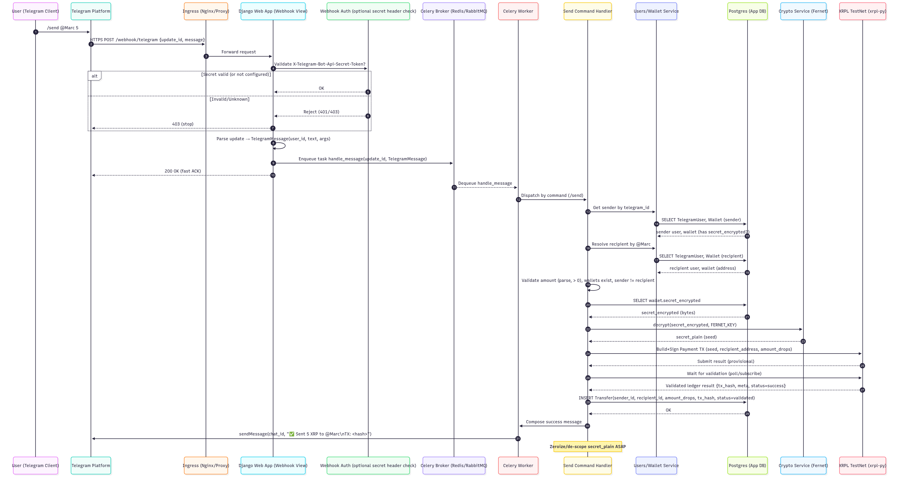
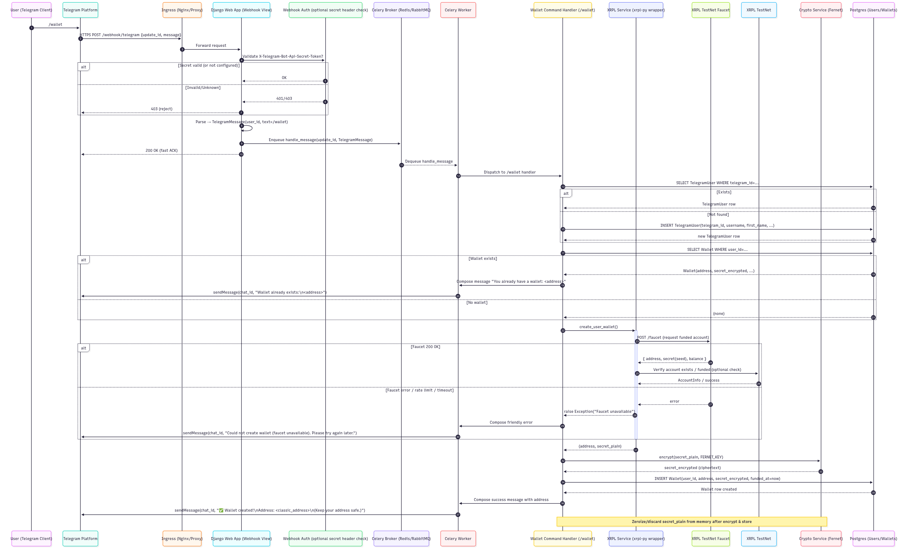

# Technical Specification Document for FSE Project ECO5040S, 2025

**Authors:**  
- Marc Levin (LVNMAR013)  
- Nolwazi Hlophe (HLPNOL001)  
- Joshua Dove (DVXJOS002)  
- Oshai Naidoo (NDXOSH003)

**Date:** 26 September 2025

---

## Table of Contents

1. [Functional Requirements](#functional-requirements)
2. [UI Mockups](#ui-mockups)
3. [Implementation](#implementation)
4. [Technology Justification](#technology-justification)
5. [Architecture Diagrams](#architecture-diagrams)
6. [Sequence Diagrams](#sequence-diagrams)
7. [How It Works](#how-it-works)
8. [Evaluation](#evaluation)

---

## Functional Requirements

### Broad Overview

The **XRP Telegram Bot** is a custodial crypto asset manager that integrates with the Telegram messaging platform and the XRP Ledger (XRPL) TestNet. It allows users to:

- Register using their Telegram handle  
- Automatically create XRPL TestNet accounts  
- Send XRP to other bot users  
- Check XRP balances  
- Request historical price data using the CoinGecko API  

> **Note:** This system is intended for test and educational use, not for real-world XRP MainNet transactions.


### Scope

**In Scope:**

- User registration via Telegram `/start` command  
- Custodial XRPL TestNet wallet creation and key management  
- Peer-to-peer XRP transfers between users via Telegram handles  
- Balance lookups on XRPL TestNet  
- Historical XRP price queries using date ranges  
- Multi-currency support for price data (USD, ZAR)  
- Webhook-based integration with the Telegram Bot API  

**Out of Scope:**

- XRPL MainNet deployment  
- Fiat on/off ramps (e.g., card payments, withdrawals)  
- Multi-signature wallet support  
- Portfolio tracking or trading features  
- Integration with other blockchain networks  

---

### Requirements

#### Telegram Bot Interface

- **FR-1: User Registration on `/start`**  
  Register users with their Telegram handle and create a new XRPL TestNet wallet.  
  The bot will respond with a welcome message and the new XRPL address.  
  **Requirement:** Must complete within 10 seconds.

- **FR-2: List Commands with `/help`**  
  The bot must list all supported commands with brief descriptions and usage examples.  
  Commands should be grouped by category (Account, Payments, Prices, General).

- **FR-3: Balance Inquiry with `/balance`**  
  The bot must return the current XRP balance in real-time from the XRPL TestNet.  
  Optionally, it should display equivalent values in USD or ZAR and support other XRPL-issued tokens.

- **FR-4: XRP Transfers with `/send`**  
  Users can send XRP by specifying a Telegram handle and amount.  
  The bot must validate the recipient, confirm the sender’s balance, prompt for confirmation,  
  and notify both parties of the transaction outcome and fee.

- **FR-5: Historical Price Queries with `/price`**  
  The bot must support date-range queries for historical XRP price data.  
  It should validate start and end dates, limit queries to max 5 years,  
  support relative dates like “last 7 days” or “last month,”  
  and return readable price data with summary statistics.  
  Supported currencies: **USD** (default) and **ZAR**.

- **FR-6: Error Handling**  
  Provide friendly error messages for malformed commands, handle network/API failures gracefully,  
  and communicate rate limiting to users.

- **FR-7: Standard Telegram Commands**  
  Support `/start`, `/help` , `/settings`, and `/cancel` commands for standard bot interactions.

#### XRPL Account Management

- **FR-8: Wallet Generation**  
  Generate XRPL TestNet wallets using `xrpl-py` SDK.  
  Encrypt secrets with Fernet and store securely in DB.  
  **Requirement:** Must complete within 5 seconds.

- **FR-9: Initial Funding**  
  Each new account must receive ≥100 XRP from the TestNet faucet.  
  Trigger up to 3 retries if funding fails and notify users after confirmation.

- **FR-10: Secure Key Management**  
  Store private keys encrypted at rest (Fernet).  
  Keep encryption keys separate from main DB, never log/expose keys,  
  and only decrypt keys for transaction signing.

- **FR-11: Balance Monitoring**  
  Retrieve up-to-date balances on request, cache temporarily,  
  and track balance changes after transactions.

- **FR-12: Transaction Execution**  
  Sign transactions securely, validate balances/addresses,  
  calculate/display fees, and confirm success/failure to sender and recipient.  
  Implement atomic processing with rollback if needed.

#### Historical Price Data

- **FR-13: CoinGecko Integration**  
  Use CoinGecko’s Market Chart Range API.  
  Convert input dates to UNIX timestamps, handle rate limits/timeouts/failures,  
  and cache frequent queries.

- **FR-14: Date Validation**  
  Accept ISO (YYYY-MM-DD) and relative date terms.  
  Ensure start < end date and max range ≤ 5 years.

- **FR-15: Data Presentation**  
  Show daily closing prices, summarize with min/max/avg,  
  and display in user’s preferred currency.


### Non-Functional Requirements

- **Security:**  
  - Fernet encryption for keys  
  - No sensitive info in logs  
  - HTTPS for all communications  
  - Prevent injection attacks  

- **Performance:**  
  - Response time ≤ 2s under normal load  
  - Indexed queries, caching for price/balance lookups  

- **Reliability:**  
  - 99% uptime during business hours  
  - Retry mechanisms for failed operations  
  - Atomic, consistent transactions  

- **Testability:**  
  - Unit tests for core logic  
  - Integration tests for XRPL and CoinGecko  
  - Mockable APIs, separate test/production DBs  

- **Deployability:**  
  - Packaged with Docker, `.env`-based config  
  - Automated migrations  
  - Zero-downtime deploys and documented rollback
  - Deploy to Render.com or similar platform


### Future Enhancements

- **Functional Additions:**  
  Support XRPL token balances, price alert subscriptions,  
  user-facing portfolio dashboard, multi-signature wallets.

- **Admin & Monitoring Tools:**  
  Web dashboard for admin and transaction monitoring.

- **Scalability:**  
  Transition toward microservices, event-driven queues,  
  database sharding, and optional CDN for global performance.


## UI Mockups

### Start
```
👤 User: /start
🤖 Bot:
🚀 Welcome to XRPL Bot, Marc!

I'll help you manage XRP on the XRPL TestNet.

We created your account. You can use /help to see available commands.
```

### Help
```
👤 User: /help
🤖 Bot:
📋 Available Commands:

/start - Get started with the bot
/balance - Check your XRP balance
/send @username amount - Send XRP to another user
/prices [symbol] [days] - Get price history (default: XRP, 30 days)
/prices [symbol] [start] [end] - Use a custom range (YYYY-MM-DD)
/wallet - Create a new XRPL wallet
/help - Show this help message

Example: /send @alice 10.5
```

### Balance
```
👤 User: /balance
🤖 Bot:
💰 Your balance: 123.45 XRP
```
### Send
```
👤 User: /send @alice 10.5
🤖 Bot:
⏳ Sending 10.5 XRP to @alice...
✅ Sent 10.5 XRP to @alice!
TX Hash: 1234ABCD5678...
```
### Prices
```
👤 User: /prices xrp 7
🤖 Bot:
📈 XRP price history
Range: 2025-09-18 → 2025-09-25

• 2025-09-18: USD: $0.5270 | ZAR: R9.8650
• ...
📊 Change: USD: +2.15% | ZAR: +2.34%
```

### Wallet
```
👤 User: /wallet
🤖 Bot:
🆕 Wallet created!
Address: rEXAMPLE12345...
You have been credited with some test XRP.
Use /balance to check your balance.
```

### Error Handling

Error handling is uniform across all commands, where we provide clear, friendly messages for common issues. As an example:
```
👤 User: /send @bob 1000
🤖 Bot:
❌ Insufficient balance. Your current balance is 123.45 XRP.
```

## Implementation

### XRPL Service

The Django app `bot_backend.apps.users.xrpl_service` wraps the `xrpl-py` client in a small `XRPLClient` that is pre-configured for the XRPL TestNet RPC endpoint. A single global client instance exposes helpers such as `get_balance`, `send_xrp`, and `create_user_wallet`, which the rest of the codebase imports as simple functions. New wallets are generated and funded via the testnet faucet and returned as a `GeneratedWallet` dataclass, while supporting utilities like `get_transaction_history` and `wait_for_balance_update` make troubleshooting ledger interactions possible without adding async code to the request path.

### Telegram Bot

Incoming webhook payloads are normalised by `telegram_bot.messages.parse_telegram_message` into a `TelegramMessage` dataclass so the bot ignores anything that is not a slash-command. The `TelegramBot` class in `telegram_bot.bot` keeps the Bot API token, registers handlers from `telegram_bot.commands`, and sends replies through the Telegram REST API. Each command module sends a quick acknowledgement to the user and then hands the structured payload off to Celery so that the webhook can return immediately even when XRPL or CoinGecko calls are slow.

### Celery Workers

`telegram_bot/tasks.py` defines `shared_task`s on the `telegram_bot` queue; when a worker receives a payload it rebuilds the `TelegramMessage` and executes the command logic in the background. `/start` ensures there is a `TelegramUser` record, `/wallet` provisions an XRPL wallet via `create_user_wallet`, and `/balance` fetches live balances with `xrpl_service.get_balance`. `/send` persists a `Transfer` row, decrypts the stored seed with `decrypt_secret`, submits the payment through `send_xrp`, and updates the record with the resulting transaction hash and status. `/prices` calls `bot_backend.apps.botutils.price_history.fetch_price_history`, captures any API failures, and formats a concise, Telegram-friendly report before sending it back through the bot.

### Database

Postgres is the primary datastore (see `bot_backend/settings/base.py`), and migrations are executed automatically by the container entrypoint. The `TelegramUser`, `Wallet`, and `Transfer` models in `bot_backend.apps.users.models` capture Telegram identities, XRPL addresses, and transaction history so that transfers can be reconciled after the fact. Wallet secrets are encrypted with `cryptography.Fernet` (`bot_backend.apps.users.crypto`) using the `FERNET_KEY` environment variable before they are stored, and the Celery tasks rely on these models to validate state (for example, refusing to send if either party lacks an active wallet).

### Redis

Redis provides the Celery broker and result backend, which keeps webhook responses lightweight and allows the worker pool to absorb coin price lookups or XRPL submissions without blocking Django. The default configuration points to `redis://redis:6379/0`, and the development compose file provisions a matching Redis 7 instance.

### Docker

The deployment image is described in `deploy/Dockerfile`, which installs Python 3.12 dependencies, creates a non-root user, and delegates start-up to `scripts/entrypoint.sh`. `compose/docker-compose.dev.yml` wires together the web service (Django + Uvicorn), a dedicated Celery worker, Postgres 16, and Redis, all sharing the same workspace via bind mounts and `.env` files so code and settings stay in sync across processes.

### Deployment

At runtime the entrypoint script applies migrations, collects static assets, optionally runs `manage.py set_webhook` to register the Telegram webhook, and then launches Uvicorn. The webhook view at `telegram_bot/webhook.telegram_webhook` validates incoming POSTs, schedules the corresponding task, and always returns a JSON acknowledgement so Telegram will not retry unnecessarily. A lightweight `health_check` endpoint exposes the bot token status and API base URL to support load balancers or uptime checks. We deploy to Render.com, which provides free TLS termination and a stable public URL for the webhook.


## Technology Justification

### Problem and Impact
Educational blockchain platforms often lack real-time interactivity, secure custodial features, and strong user experience. Most tools require extensive manual setup, are not easily embeddable within messaging platforms like Telegram, and do not integrate real-time data such as price feeds. Require too much manual setup for XRPL wallets. Do not integrate with real-time data (e.g., price lookups). Not bridging these gaps limits hands-on learning within blockchain construction. It reduces student exposure to production-like environments and blocks scalable adoption of crypto tools in education. Therefore, the XRP Telegram Bot is a custodial blockchain wallet manager and data tool, built using Telegram Bot API (Webhook-based), XRPL TestNet + xrpl-py SDK, CoinGecko API, Python, PostgreSQL and Docker.

### Choice of Stack
The infrastructure chosen for the XRP Telegram Bot reflects standard practice in scalable web and fintech application development. The stack was selected for its real-world relevance, modular design, developer ecosystem, and alignment with best practices in blockchain-based architecture.

#### Industry Standard Alignment
Each technology used is widely adopted in industry:
- Large sites as well as fintech companies use **Django** for its robust security features and rapid development potential.
- **Celery** is a de facto go-to for asynchronous background tasks, which are important in systems dealing with flaky networks and third-party APIs like XRPL and CoinGecko. Celery was necessary for non-blocking. For blockchain and messaging use cases, operations like retrieving XRP from the faucet or retrying failed API calls are time-consuming. Delays these to Celery workers to maintain a responsive bot interaction.
- **PostgreSQL** is a solid RDBMS that excels in transactional integrity and processing encrypted data at scale.
- Portability and reproducibility are offered by **Docker**, used in nearly every modern CI/CD pipeline and cloud deployment.

#### Speed and Scalability 
The stack is designed for responsiveness and future growth:
- **Django** facilitates rapid prototyping and clean API design.
- **Celery workers** enable asynchronous processing of tasks such as delayed faucet funding, retries and background price caching, to improve performance without blocking the user interface.
- **PostgreSQL** enables write-intensive applications and ensures data consistency when there is a high concurrency of requests.
- **Docker** allows the whole system to scale horizontally by running multiple containerised instances, and it is easy to duplicate the environment between staging and production setups.

#### Rationale for Key Components
- **Celery** was utilised for non-blocking work. In the messaging and blockchain use cases, actions like requesting XRP at the faucet or re-sending failed API requests are time-consuming. Offloading these onto Celery workers maintains the responsiveness of the bot experience.
- **Docker** provides consistent development and deployment environments. It ensures that the entire stack, ranging from dependencies to configurations, to environment variables, runs the same on any server or machine.
- **Django** was chosen for its built-in admin interface, ORM, routing, and security framework. It supports easy generation of API endpoints, management of users, and authentication, which accelerates development.
- **PostgreSQL** was used because it scales well, is reliable, and can store encrypted user information, like XRPL credentials, in a compliant and query-efficient manner.


---

## Architecture Diagrams


## Sequence Diagrams

### Send



### Wallet


### Prices


## How It Works

The user interacts with the Telegram bot by sending a message on Telegram. This message will be a command such as `/start`, `/wallet`, `/balance`, `/send`, or `/prices`. The message is forwarded by Telegram to the Django backend via a webhook endpoint.
The Django view acknowledges receipt immediately and places the request into a Celery task queue, ensuring that long running operations do not block the webhook, such as communication with the XRP Ledger or external APIs. Celery workers then handle the actual processing:

- **/start**
  - Verifies that a user record exists
  - Replies with a welcome message

- **/wallet**
  - Creates and funds a new TestNet wallet using the `xrpl-py` library
  - Stores the encrypted secret key in the database

- **/balance**
  - Retrieves and displays the user’s XRP balance from the ledger

- **/send**
  - Decrypts the sender’s key
  - Signs and submits a payment transaction to the ledger
  - Records the transfer in the database
  - Replies with a transaction hash

- **/prices**
  - Queries the CoinGecko API to fetch historical XRP prices (ZAR by default)
  - Returns a formatted summary

- **/help**
  - Returns a concise guide to available commands


The system relies on three core models, `TelegramUser`, `Wallet`, and `Transfer`, to manage accounts, keys, and payments, ensuring that all interactions remain auditable.
Security and reliability are built into the bot’s design. Because the project follows a custodial model, each user's wallet secret is encrypted at rest with a Fernet key. This is supplied via environment variables rather than stored in the codebase, which protects the private keys even if the database were accessed directly. Webhook communication is lightweight, with the actual processing delegated to Celery workers, thus preventing timeouts and duplicate retries from Telegram. External API calls, such as those to CoinGecko, are safeguarded with strict five second timeouts, limited retries, and clear error handling so users always receive timely and understandable feedback. XRPL transactions are only marked successful once they are validated on the TestNet ledger, guaranteeing consistency in balances and transfers.

Together, these measures ensure that the bot remains responsive and robust, even when external services are slow, while providing a secure environment for custodial wallet management.

## Evaluation

We evaluate this project based on the functional requirements and document where the current build meets or diverges from the original goals.

### Requirement Fulfillment

#### Telegram Bot Interface
- **FR-1 – User Registration on `/start`**: *Partially met*. The bot creates a user record and greets the user, but wallet creation now lives under `/create_wallet`, so registration no longer provisions an XRPL account within the command.
- **FR-2 – List Commands with `/help`**: *Partially met*. The help task enumerates all supported commands with a usage example, but it does not group them by category as the requirement specified.
- **FR-3 – Balance Inquiry with `/balance`**: *Met*. The balance task validates the user, fetches a live XRPL balance, and responds with the value in XRP. Fiat equivalents are optional and skipped.
- **FR-4 – XRP Transfers with `/send`**: *Partially met*. Transfers validate sender, recipient, and funds, persist a transaction record, sign via XRPL, and report success to the sender. There is no confirmation prompt, recipient notification, or fee breakdown.
- **FR-5 – Historical Price Queries with `/price`**: *Partially met*. The bot supports date-range queries with ISO or day ranges and limits the window to 90 days, but it does not accept relative phrases (e.g., “last month”), lacks the five-year span due to API limits, and the response omits min/max/avg summaries.
- **FR-6 – Error Handling**: *Met*. Each task returns friendly error messages and handles third-party failures gracefully (e.g., API timeouts). Rate-limit messaging is still absent.
- **FR-7 – Standard Telegram Commands**: *Not met*. Only `/start` and `/help` are registered. `/settings` and `/cancel` are unimplemented since they were not needed for core flows.

#### XRPL Account Management
- **FR-8 – Wallet Generation**: *Partially met*. Wallets are generated and encrypted via **Fernet** when users issue `/create_wallet`, but the requirement expected this to happen automatically on `/start` with a ≤5s guarantee, which we no longer satisfy or measure.
- **FR-9 – Initial Funding**: *Partially met*. The faucet-funded wallet typically arrives with ≥10 XRP, yet there is no retry loop or explicit balance verification before notifying the user.
- **FR-10 – Secure Key Management**: *Met*. Secrets are encrypted with Fernet using an environment-provided key and only decrypted for signing.
- **FR-11 – Balance Monitoring**: *Partially met*. Live balances are queried from XRPL per request, but there is no caching strategy or post-transfer change tracking, the latter being unnecessary without a persistent balance display.
- **FR-12 – Transaction Execution**: *Partially met*. Transactions are signed securely and persisted with status updates, yet we do not expose fee calculations, notify recipients, or offer rollback beyond marking a transfer failed.

#### Historical Price Data
- **FR-13 – CoinGecko Integration**: *Partially met*. The worker hits CoinGecko’s market-chart endpoints and surfaces API errors, but frequent query caching and explicit rate-limit handling remain TODOs.
- **FR-14 – Date Validation**: *Partially met*. ISO dates and positive day windows are validated with start-before-end checks, though natural language ranges are unsupported and the max window is capped at 90 days.
- **FR-15 – Data Presentation**: *Partially met*. Responses list daily USD/ZAR prices with percent change and warnings, but min/max/avg statistics and user-selectable currency preferences are not implemented.

### Non-Functional Requirement Fulfillment

- **Security:**  
  - Fernet encryption for keys - Met
  - No sensitive info in logs - Met
  - HTTPS for all communications - Met
  - Prevent injection attacks - Met

- **Performance:**  
  - Response time ≤ 2s under normal load - Met
  - Indexed queries, caching for price/balance lookups - Partially met (no caching yet)

- **Reliability:**  
  - 99% uptime during business hours (We don't have business hours) - N/A
  - Retry mechanisms for failed operations - Partially met (no explicit retries implemented)
  - Atomic, consistent transactions - Met

- **Testability:**  
  - Unit tests for core logic - Unmet (No tests yet)  
  - Integration tests for XRPL and CoinGecko  - Unmet (No tests yet)
  - Mockable APIs, separate test/production DBs - Not met (Single DB, no mocks)

- **Deployability:**  
  - Packaged with Docker, `.env`-based config - Met  
  - Automated migrations - Met 
  - Zero-downtime deploys and documented rollback - Not met (No CI/CD yet)
  - Deploy to Render.com or similar platform - Met


### Final Notes on Evaluation
Overall, the project meets many core functional requirements but falls short of full compliance in several areas, particularly around user experience polish, error handling, and test coverage. Non-functional goals around security and performance are largely satisfied, though reliability and deployability need further work. Future iterations should prioritize completing partial features, adding tests, and implementing caching and retry strategies to enhance robustness.
